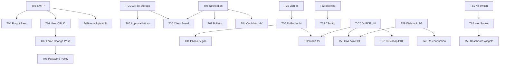

# Kế hoạch triển khai các chức năng còn thiếu — EduPort

> Cập nhật: dựa trên audit ngày 2026-05-06 (xem `reports/usecase_diagrams.md`).
>
> Phạm vi: ~65 task được nhóm thành **6 sprint** (mỗi sprint ~1.5–2 tuần) cộng với
> các hạng mục **cross-cutting**. Mỗi task có:
> - Role / Priority (P0–P3) / Effort (S=≤1d, M=2–3d, L=4–6d, XL=>1w)
> - Phụ thuộc
> - DB / Backend / Frontend cụ thể (theo convention sẵn của repo)
> - Acceptance criteria (DoD)
>
> Convention bám theo code hiện tại:
> - Migration: `backend-core/src/main/resources/db/migration_<topic>_sprint<N>.sql`
> - Entity: `backend-core/src/main/java/com/example/demo/domain/entity/`
> - Repo: `repository/`, Service: `service/IXxxService` + `service/impl/XxxServiceImpl`
> - Controller: `controller/`, DTO: `payload/request|response/`
> - Frontend page: `frontend/src/pages/<TenPage>.jsx`, route trong `App.jsx`
> - Sidebar link: `layouts/AdminLayout.jsx | TeacherLayout.jsx | StudentLayout.jsx`

---

## Mục lục

- [SPRINT 1 — Quản trị tài khoản, thông báo, audit nâng cao](#sprint-1)
- [SPRINT 2 — Master data & UI xếp lịch](#sprint-2)
- [SPRINT 3 — Khảo thí + Giảng viên nâng cao + Đơn từ + Cảnh báo HV](#sprint-3)
- [SPRINT 4 — Tài chính nâng cao + Hóa đơn điện tử](#sprint-4)
- [SPRINT 5 — UX Sinh viên & realtime](#sprint-5)
- [SPRINT 6 — Vận hành Giờ Vàng nâng cao + i18n + extras](#sprint-6)
- [Cross-cutting](#cross-cutting)
- [Risk & Dependency Map](#risks)
- [Checklist tổng](#checklist)

---

# SPRINT 1 — Quản trị tài khoản, thông báo, audit nâng cao
**Thời lượng**: 2 tuần · **Mục tiêu**: lấp các gap "xương sống" mà đội đào tạo dùng hằng ngày.

## T01. CRUD tài khoản User & Role  
**Role**: Admin · **Priority**: P0 · **Effort**: L

**DB**
- Sử dụng entity `User` đã có. Bổ sung cột:
  - `must_change_password BOOLEAN DEFAULT false`
  - `password_changed_at TIMESTAMP`
  - `failed_login_count INT DEFAULT 0`
  - `locked_until TIMESTAMP NULL`
- Migration: `migration_user_admin_sprint6.sql`

**Backend**
- DTO:
  - `AdminUserCreateRequest` (username, fullName, email, role, ngayCapPasswordTam=true)
  - `AdminUserUpdateRequest`
  - `AdminUserResponse`
  - `AdminUserListItemResponse`
- Repository: mở rộng `UserRepository` → `findByUsernameContainingOrEmailContaining`, filter theo role/active.
- Service: `IAdminUserService` + `AdminUserServiceImpl`
- Controller `AdminUserController`:
  - `GET /api/v1/admin/users?role=&q=&page=`
  - `POST /api/v1/admin/users` (sinh password tạm random, gán `must_change_password=true`, gửi email — hoặc trả về dạng response cho admin in giấy)
  - `PUT /api/v1/admin/users/{id}` (đổi role, fullName, email)
  - `POST /api/v1/admin/users/{id}/lock` / `unlock`
  - `DELETE /api/v1/admin/users/{id}` (soft delete)
  - `POST /api/v1/admin/users/{id}/reset-password` → trả password tạm

**Frontend**
- Page mới: `AdminUserManagementPage.jsx`
- Route: `/admin/users` trong `App.jsx`
- Sidebar `AdminLayout.jsx`: thêm link "Tài khoản & Quyền"
- Tính năng UI:
  - Bảng list + search + filter role + paginate
  - Modal tạo user (chọn role, gửi email tạm)
  - Modal sửa, lock/unlock, reset password
  - Hiển thị "Đã đăng nhập gần nhất", "Đang khóa đến…"

**Acceptance**
- [ ] Admin tạo được SV/GV với password tạm in ra màn hình
- [ ] Admin lock account → người đó login bị 423 hoặc 401 thông báo bị khóa
- [ ] Reset password sinh chuỗi mới + bắt đổi lần đầu

---

## T02. Force change password lần đầu + đổi định kỳ  
**Role**: ALL · **Priority**: P1 · **Effort**: M · **Phụ thuộc**: T01

**Backend**
- Bổ sung filter check: nếu `must_change_password=true` → mọi API trừ `/auth/*` và `/users/me/change-password` → trả 403 với mã `PASSWORD_CHANGE_REQUIRED`.
- Endpoint: `POST /api/auth/change-password` (oldPassword, newPassword) → set `password_changed_at = now()`, `must_change_password=false`.
- Cấu hình `eduport.security.password-expiry-days` (default 180); cron nightly đẩy `must_change_password=true` cho tài khoản quá hạn.

**Frontend**
- Component `ForcePasswordChangeModal` overlay khi nhận 403 với mã đó.
- Trang `/account/password` cho user tự đổi tự nguyện.

**Acceptance**
- [ ] User mới login lần đầu → bị chặn vào dashboard, hiện modal đổi pass.
- [ ] Quá 180 ngày → cron đặt cờ → next login bắt đổi.

---

## T03. Password Policy + complexity validator  
**Role**: ALL · **Priority**: P1 · **Effort**: S · **Phụ thuộc**: T02

**Backend**
- Validator regex: ≥ 8 ký tự, có chữ hoa, thường, số, ký tự đặc biệt; cấm dùng lại 3 mật khẩu gần nhất → bảng `password_history(user_id, password_hash, created_at)` (gợi ý migration `migration_password_history_sprint6.sql`).
- DTO: `ChangePasswordRequest` với `@Pattern`.

**Frontend**
- Strength meter (zxcvbn-ts hoặc tự viết).

**Acceptance**: pass yếu hoặc trùng quá khứ → 400 message rõ.

---

## T04. Forgot password (email reset link)  
**Role**: ALL · **Priority**: P1 · **Effort**: M · **Phụ thuộc**: T08 (SMTP)

**DB**: bảng `password_reset_token(id, user_id, token_hash, expires_at, consumed_at)`. Migration `migration_password_reset_sprint6.sql`.

**Backend**
- `POST /api/auth/forgot-password` body `{username|email}` → tạo token random 32 byte, hash lưu DB, gửi email link `/reset-password?token=...`.
- `POST /api/auth/reset-password` `{token, newPassword}`.
- TTL token 30 phút, dùng 1 lần.

**Frontend**
- Page `ForgotPasswordPage.jsx`, `ResetPasswordPage.jsx`. Link từ trang `/login`.

**Acceptance**: token quá hạn / dùng lần 2 → 400.

---

## T05. Approval workflow đổi hồ sơ SV  
**Role**: SV + Phòng đào tạo · **Priority**: P1 · **Effort**: L

**DB**: bảng `ho_so_change_request(id, sinh_vien_id, field_name, old_value, new_value, evidence_url, status[PENDING|APPROVED|REJECTED], reviewer_id, reason, created_at, reviewed_at)`. Migration `migration_hoso_change_request_sprint6.sql`.

**Backend**
- DTO: `HoSoChangeRequestCreateRequest` (field, newValue, evidenceUrl), `HoSoChangeRequestReviewRequest` (status, reason).
- Repo: `HoSoChangeRequestRepository`.
- Service `IHoSoChangeRequestService`:
  - SV tạo (auto pending các field thuộc whitelist: `cccd, hoTen, bhyt, queQuan, danToc`).
  - SV update field tự do (`email`, `dienThoai`) đi thẳng vào `HoSoSinhVien` không cần duyệt.
  - Admin review → khi APPROVE thì áp giá trị mới vào `HoSoSinhVien`.
- Controller:
  - SV: `POST /api/v1/student-profile/change-requests`
  - SV: `GET /api/v1/student-profile/change-requests/me`
  - Admin: `GET /api/v1/admin/profile-change-requests?status=`
  - Admin: `PATCH /api/v1/admin/profile-change-requests/{id}` (review)

**Frontend**
- Bổ sung trên `TraCuHSCNhnThTcOnline.jsx`: nút "Yêu cầu đổi" cho field yêu cầu duyệt, có upload ảnh minh chứng (tận dụng module file storage T-CC03).
- Trang admin `AdminProfileChangeRequestsPage.jsx` route `/admin/profile-change-requests`.

**Acceptance**
- [ ] SV nộp request → trạng thái Pending hiển thị
- [ ] Admin approve → giá trị áp vào hồ sơ
- [ ] Audit log ghi action (T09)

---

## T06. Notification service & Inbox  
**Role**: ALL · **Priority**: P1 · **Effort**: L

**DB**: dùng entity `NotificationQueue` đã có; bổ sung cột nếu thiếu: `read_at`, `category` (`SYSTEM|CLASS|FINANCE|EXAM|ACADEMIC`), `link_url`. Migration `migration_notification_inbox_sprint6.sql`.

**Backend**
- DTO: `NotificationListItemResponse`, `NotificationDetailResponse`, `NotificationMarkReadRequest`.
- Service `INotificationService` + `NotificationServiceImpl`:
  - `enqueue(userId, category, title, body, linkUrl)`
  - `enqueueByRole(role, ...)`, `enqueueByKhoa(khoaId, ...)`, `enqueueByLopHocPhan(lhpId, ...)`
  - `markRead`, `markAllRead`.
- Controller `NotificationController`:
  - `GET /api/v1/notifications/me?unread=&page=`
  - `PATCH /api/v1/notifications/{id}/read`
  - `PATCH /api/v1/notifications/me/read-all`

**Frontend**
- Component `NotificationBell.jsx` (chuông + badge số chưa đọc) gắn vào header tất cả layouts.
- Trang `NotificationInboxPage.jsx` cho `/student/inbox`, `/teacher/inbox`, `/admin/inbox` (cùng component dùng route khác nhau).

**Acceptance**: chuông hiện badge realtime (poll 30s; sau này nâng WebSocket – T62).

---

## T07. Bulletin / Broadcast push (Admin)  
**Role**: Admin · **Priority**: P1 · **Effort**: M · **Phụ thuộc**: T06

**Backend**
- DTO: `BulletinCreateRequest(title, body, audience{ALL|ROLE|KHOA|NGANH|KHOA_HOC|LOPHOCPHAN}, audienceIds[], scheduleAt)`.
- Service `IBulletinService` → fan-out vào `NotificationQueue` cho từng user thuộc audience.
- Controller `AdminBulletinController`:
  - `POST /api/v1/admin/bulletins`
  - `GET /api/v1/admin/bulletins`
  - `DELETE /api/v1/admin/bulletins/{id}` (recall — set notif đã enqueue thành recalled)

**Frontend**
- `AdminBulletinPage.jsx` route `/admin/bulletins`. Editor markdown, preview, audience selector cascade (Khoa → Ngành → Khóa).

**Acceptance**: SV/GV thuộc audience nhận notification trong inbox.

---

## T08. SMTP thật + cấu hình  
**Role**: System · **Priority**: P0 · **Effort**: S

**Backend**
- `application.properties`: `spring.mail.host`, `port`, `username`, `password`, `properties.mail.smtp.starttls.enable=true`.
- Service `IEmailService` → wrapper `JavaMailSender`, expose `send(to, subject, htmlBody)`.
- Refactor `MfaOtpDelivery` từ log → gọi `IEmailService`.
- Hook vào T04 (forgot pass), T01 (gửi password tạm).

**Frontend**: không có; chỉ cấu hình.

**Acceptance**: gửi mail OTP MFA, reset password thành công ra mailtrap/SMTP test.

---

## T09. Audit trail mở rộng (login, register, payment, drop)  
**Role**: System · **Priority**: P1 · **Effort**: M

**Backend**
- Mở rộng `AuditTrailService.log()` với action codes mới: `LOGIN_SUCCESS, LOGIN_FAIL, MFA_PASS, MFA_FAIL, REG_SUCCESS, REG_FAIL_<reason>, REG_DROP, PAY_INITIATE, PAY_CONFIRM, PROFILE_CHANGE_REQUEST, PROFILE_CHANGE_APPROVE`.
- Hook vào: `AuthController.login`, `MfaOtpServiceImpl.verify`, `DangKyHocPhanServiceImpl`, `PaymentServiceImpl`, `HoSoChangeRequestService`.
- Mở rộng filter `AdminAuditTrailController`: `action`, `userId`, `from`, `to`, `q`.

**Frontend**: trang `LchSNhtKDuChnAuditTrailsLogging.jsx` thêm filter theo action + xuất CSV.

**Acceptance**: tất cả action then chốt đều xuất hiện ở audit page.

---

## T10. Device manager (sessions + revoke)  
**Role**: ALL · **Priority**: P2 · **Effort**: L

**DB**: bảng `user_session(id, user_id, refresh_token_hash, ip, user_agent, created_at, last_seen_at, revoked_at)`. Migration `migration_user_session_sprint6.sql`.

**Backend**
- Đổi auth flow: login trả `accessToken` (TTL 15p) + `refreshToken` (TTL 7d) lưu hash vào DB.
- `POST /api/auth/refresh`, `POST /api/auth/logout` (revoke session hiện tại), `GET /api/v1/account/sessions` (list), `DELETE /api/v1/account/sessions/{id}` (revoke), `DELETE /api/v1/account/sessions/all-others`.

**Frontend**
- Trang `AccountSecurityPage.jsx`: `/student/account/security`, `/teacher/...`, `/admin/...` (dùng chung component).

**Acceptance**: revoke session → token đó không refresh được nữa.

---

## T11. Auto-logout idle 15 phút  
**Role**: ALL · **Priority**: P2 · **Effort**: S · **Phụ thuộc**: T10

**Frontend**
- Hook `useIdleTimeout(15 * 60 * 1000)` trong các Layout: nếu idle quá ngưỡng → `clearSession()` + redirect `/login`.
- Lắng nghe `mousemove`, `keydown`, `visibilitychange`.

**Acceptance**: bỏ trang 15p → tự logout.

---

## T12. SSO Email trường (OAuth2 Google Workspace) — *Optional*  
**Role**: ALL · **Priority**: P3 · **Effort**: L

Để dành cho phase sau nếu trường có Google Workspace; dùng `spring-security-oauth2-client`. Không bắt buộc cho đồ án.

---

# SPRINT 2 — Master data & UI xếp lịch
**Thời lượng**: 2 tuần · **Mục tiêu**: route hóa các controller backend đã có sẵn + bổ sung các CRUD còn thiếu UI.

## T13–T18. CRUD master data đầy đủ  
Backend đã có controller cơ bản (`KhoaController`, `NganhDaoTaoController`, `HocPhanController`, `HocKyController`, `LopHocPhanController`, `GiangVienController`). **Cần bổ sung phần thiếu + UI quản trị**.

| Task | Entity | Trạng thái BE | Bổ sung BE | Frontend page mới |
|---|---|---|---|---|
| T13 | `Khoa` | ✅ list/get | thêm `POST/PUT/DELETE` admin | `AdminKhoaPage.jsx` `/admin/master/khoa` |
| T14 | `NganhDaoTao` | ✅ | thêm CUD | `AdminNganhPage.jsx` |
| T15 | `HocKy` | ✅ | active flag, lock đăng ký | `AdminHocKyPage.jsx` |
| T16 | `HocPhan` | ✅ | tiên quyết, song hành (bảng `HP_TienQuyet(hp_id, prereq_hp_id)`); migration `migration_hocphan_prereq_sprint7.sql` | `AdminHocPhanPage.jsx` + `HocPhanPrereqDialog.jsx` |
| T17 | `Lop` (HC) | ✅ | gắn ngành/khóa, list SV | `AdminLopPage.jsx` |
| T18 | `GiangVien` | ✅ | gán Khoa, chuyên môn, học vị | `AdminGiangVienPage.jsx` |

**Common**:
- Tất cả page: search, filter, paginate, modal create/edit.
- Service tầng admin tách riêng: `IAdminMasterDataService` các method bulk.
- Sidebar `AdminLayout.jsx`: nhóm "Master Data" gom 6 link.

**Effort**: T13/14/15/17/18: M · T16: L (vì có UI gán tiên quyết).

**Acceptance**: tất cả CUD audit log + RBAC `ADMIN_DAO_TAO`.

---

## T19. Import SV Excel hàng loạt  
**Role**: Admin · **Priority**: P1 · **Effort**: L

**Backend**
- DTO: `ImportSinhVienRequest` multipart file.
- Dùng Apache POI (`poi-ooxml`) parse file mẫu (cột: MSSV, Họ tên, Ngày sinh, Email, SĐT, Lớp HC, Ngành).
- Service `ImportSinhVienServiceImpl`:
  - Validate từng dòng → trả `ImportReportResponse` (totalRows, ok, failed, errors[]).
  - Tạo đồng thời User (role STUDENT) với password tạm = MSSV + 4 số đuôi điện thoại; bật `must_change_password`.
- Controller: `POST /api/v1/admin/import/sinh-vien`.

**Frontend**
- Mở rộng `AdminLopPage` hoặc trang riêng `AdminImportPage.jsx`: upload file, progress, hiển thị bảng lỗi từng dòng.
- Tải template Excel mẫu (`/api/v1/admin/import/sinh-vien/template`).

**Acceptance**: import 100 SV thành công, lỗi từng dòng có row index + lý do.

---

## T20. Import GV Excel  
Tương tự T19 với entity `GiangVien` + tạo User role LECTURER. **Effort**: M.

---

## T21. Visual node CTĐT (drag-drop gắn HP vào CTĐT)  
**Role**: Admin · **Priority**: P2 · **Effort**: XL

**Backend**: tận dụng entity `ChuongTrinhDaoTao` + `CtdtHocPhan`. Bổ sung trường `khoiKienThuc` (Đại cương / Cơ sở ngành / Chuyên ngành / Tự chọn / Khóa luận), `bat_buoc bool`, `hoc_ky_du_kien`.

**Frontend**
- Lib `@dnd-kit/core` hoặc `react-flow` để dựng cây node theo khối.
- Page `AdminCtdtBuilderPage.jsx` route `/admin/ctdt/:ctdtId/build`.
- Drop HP từ palette bên phải vào node khối kiến thức.

**Acceptance**: lưu lại được cấu trúc, SV thấy degree audit cập nhật theo cấu hình mới.

---

## T22–T28. Route hóa scheduling backend đã có  
Backend đã có 8 controller xếp lịch nhưng chưa nối vào sidebar. Cần thêm trang FE:

| Task | Page | Route | Backend dùng | Effort |
|---|---|---|---|---|
| T22 | `AdminPhongHocPage.jsx` | `/admin/master/phong-hoc` | `AdminPhongHocController` + `AdminSchedulingPhongJsonController` | M |
| T23 | `AdminSlotPage.jsx` | `/admin/master/slot` | `AdminSchedulingSlotController` | M |
| T24 | `AdminGvBusyPage.jsx` | `/admin/scheduling/gv-busy` | `AdminGiangVienConstraintsController` | M |
| T25 | `AdminTkbBlockPage.jsx` | `/admin/scheduling/tkb-block` | `AdminTkbBlockController` | M |
| T26 | `AdminSolverPage.jsx` | `/admin/scheduling/solver` | `AdminSchedulingSolverController` + `AdminSchedulingForecastController` + `AdminSchedulingGridController` | L |
| T27 | `AdminScheduleChangeSetPage.jsx` | `/admin/scheduling/change-set` | `AdminScheduleChangeSetController` | L |
| T28 | Phân công GV vào LHP — bổ sung modal trong `AdminClassPublishPage` | — | dùng `LopHocPhanAssignGiangVienRequest` đã có | M |

**Common**: gom các link thành nhóm "Xếp lịch" trong `AdminLayout.jsx`.

**Acceptance** (đại diện T26): admin chạy solver → thấy heatmap conflict, accept/reject từng đề xuất.

---

# SPRINT 3 — Khảo thí + GV nâng cao + Đơn từ + Cảnh báo HV
**Thời lượng**: 2.5 tuần · **Mục tiêu**: khép vòng nghiệp vụ học vụ + lecturer.

## T29. Admin tạo lịch thi hàng loạt  
**Role**: Admin · **Priority**: P1 · **Effort**: L

**DB**: dùng entity `LichThi` đã có. Bổ sung trường `nhomThi` để gom theo HP.

**Backend**
- Service `IExamSchedulingService` `generateForHocKy(hocKyId, options)`:
  - Lấy LopHocPhan đã publish trong HK.
  - Theo input (số ca thi/ngày, ngày bắt đầu, danh sách phòng thi cho phép) → tạo LichThi cho từng LHP.
- Controller `AdminExamScheduleController`:
  - `POST /api/v1/admin/exam-schedule/generate`
  - `GET /api/v1/admin/exam-schedule?hocKyId=`
  - `PATCH /api/v1/admin/exam-schedule/{id}` (sửa thủ công)
  - `DELETE` (xóa nguyên kỳ)

**Frontend**: `AdminExamSchedulePage.jsx` `/admin/exam/schedule` — form generate + grid xem.

**Acceptance**: 1 click sinh được lịch thi cho cả HK, không trùng phòng, không 1 SV thi 2 môn cùng ca.

---

## T30. Sinh phiếu dự thi + SBD  
**Role**: Admin · **Priority**: P1 · **Effort**: M · **Phụ thuộc**: T29

**Backend**
- Service `generatePhieuDuThi(hocKyId)` → với mỗi DangKyHocPhan (đã pass điều kiện không cấm thi), tạo `PhieuDuThi(svId, lichThiId, sbd, phongThi, viTri)`.
- Endpoint `POST /api/v1/admin/exam-schedule/{hocKyId}/generate-phieu`.
- Endpoint xuất PDF `GET /api/v1/admin/exam-schedule/{hocKyId}/danh-sach-phong/{phongId}.pdf` (T32).

**Frontend**: nút "Sinh phiếu dự thi" + xem danh sách theo phòng.

---

## T31. Phân công GV gác thi  
**Role**: Admin · **Priority**: P1 · **Effort**: M

**DB**: bảng `lich_gac_thi(id, lich_thi_id, giang_vien_id, vai_tro[CHU_TICH|GAC_1|GAC_2])`. Migration `migration_lich_gac_thi_sprint8.sql`.

**Backend**
- DTO: `PhanCongGacThiRequest`, response.
- Service `IGacThiService` → tự động phân công round-robin GV cùng khoa, tránh GV đang dạy môn đó.
- Controller `AdminGacThiController` & `LecturerGacThiController` (`/api/v1/lecturer/gac-thi/me`).

**Frontend**
- Admin: trang con của ExamSchedule, tab "Phân công gác".
- Lecturer: trang `LecturerGacThiPage.jsx` `/teacher/gac-thi`.

---

## T32. In bìa thi + DSPT PDF  
**Priority**: P2 · **Effort**: M · **Phụ thuộc**: T30

**Backend**
- Lib: `openhtmltopdf` hoặc `iText`.
- Template HTML: bìa thi (Khoa, môn, ngày, ca, phòng, GV gác, list SV với cột chữ ký).
- Endpoint xuất `application/pdf`.

**Frontend**: nút download trên trang Admin/Lecturer.

---

## T33. Cấm thi do nợ HP / nghỉ vượt phép  
**Priority**: P1 · **Effort**: M · **Phụ thuộc**: T52

**Backend**
- Trước khi `generatePhieuDuThi` (T30), check 2 nguồn:
  - `Blacklist` từ T52 (nợ HP).
  - Tổng `vang/total` của `BuoiDiemDanh` > 20% → cấm thi môn đó.
- Đánh dấu `PhieuDuThi.trangThai = CAM_THI` thay vì tạo phiếu dự thi.
- SV xem trên `LchThinhGiGv.jsx` thấy badge "Cấm thi" với lý do.

---

## T34. TKB cá nhân Giảng viên  
**Role**: GV · **Priority**: P1 · **Effort**: M

**Backend**
- Endpoint `GET /api/v1/lecturer/timetable/me?hocKyId=`.
- Tận dụng `LopHocPhan.thoi_khoa_bieu_json` lọc theo `lop_hoc_phan.giang_vien_id = currentGv`.

**Frontend**
- Page `LecturerTimetablePage.jsx` `/teacher/timetable` — re-use component grid TKB từ `DchVThiKhaBiuThngMinh`.
- Cảnh báo cam khi 2 LHP cùng GV trùng giờ (báo lỗi setup).

---

## T35. QR điểm danh động (refresh 10s)  
**Role**: GV + SV · **Priority**: P2 · **Effort**: L

**Backend**
- Endpoint GV: `POST /api/v1/lecturer/attendance/{buoiId}/qr-token` → trả `token` (HMAC `buoiId|expSecond`, TTL 12s).
- Endpoint SV check-in: `POST /api/v1/attendance/me/check-in-qr` body `{token}` → verify HMAC, ghi điểm danh nếu chưa.

**Frontend**
- GV: thêm canvas QR (lib `qrcode.react`) refresh 10s trong `QunLLpGingDyimDanh.jsx`.
- SV: tab "Quét QR" trên trang điểm danh — dùng `html5-qrcode` (camera). Fallback nhập tay token nếu không có camera.

---

## T36. Class Board (thông báo lớp + push)  
**Role**: GV · **Priority**: P2 · **Effort**: M · **Phụ thuộc**: T06

**Backend**
- DTO: `ClassBoardPostRequest(lhpId, title, body)`.
- Service: tạo notification fan-out cho tất cả SV trong LHP qua `INotificationService.enqueueByLopHocPhan`.
- Lưu lịch sử bài đăng → bảng `class_board_post(id, lhp_id, gv_id, title, body, created_at)`.

**Frontend**
- Tab "Bảng tin" trong trang lớp giảng dạy.
- SV thấy ở Inbox + có 1 widget trên dashboard: "Thông báo lớp gần nhất".

---

## T37. Cột điểm có trọng số  
**Role**: GV + Admin · **Priority**: P1 · **Effort**: L

**DB**: bảng `cot_diem_cau_hinh(id, lhp_id, ten_cot, trong_so DECIMAL(5,2), thu_tu)`. Migration `migration_cot_diem_sprint8.sql`. Sửa `BangDiemMon`: thêm cột `chi_tiet_cot_diem JSONB` (giữ điểm từng cột) + giữ `diem_cuoi_ky` là tổng.

**Backend**
- DTO: `CotDiemConfigRequest` cho GV (mảng tên + %) total = 100.
- Service `GradingServiceImpl` → khi GV nhập, recalculate `diemCuoiKy = sum(diemCot[i] * trongSo[i])`.
- Endpoint `GET/PUT /api/v1/lecturer/grades/{lhpId}/cot-diem`.

**Frontend**: dialog "Cấu hình cột điểm" trong `MngLiNhpQunLimGradingSystem.jsx`.

---

## T38. Import/Export Excel điểm  
**Role**: GV · **Priority**: P2 · **Effort**: M

**Backend**
- Export: `GET /api/v1/lecturer/grades/{lhpId}/export.xlsx` (Apache POI).
- Import: `POST /api/v1/lecturer/grades/{lhpId}/import` multipart → validate + báo cáo lỗi từng dòng (như T19).

**Frontend**: 2 nút trên trang nhập điểm.

---

## T39. Ký số / OTP chốt điểm immutable  
**Role**: GV · **Priority**: P1 · **Effort**: M · **Phụ thuộc**: T22 (MFA)

**Backend**
- Endpoint `POST /api/v1/lecturer/grades/{lhpId}/lock` body `{otp}`:
  - Verify OTP qua `IMfaOtpService` (gửi tới email GV).
  - Set `BangDiemMon.locked_at`, `locked_by_otp_challenge_id`.
  - Audit log `GRADING_LOCK`.
- Sau khóa, mọi PATCH grade trả 403 trừ khi admin override.

**Frontend**: nút "Chốt điểm" → modal nhập OTP.

---

## T40. Lịch coi thi cá nhân + xác nhận ca gác  
**Role**: GV · **Priority**: P2 · **Effort**: S · **Phụ thuộc**: T31

**Backend**: `GET /api/v1/lecturer/gac-thi/me`, `PATCH /api/v1/lecturer/gac-thi/{id}/confirm`.

**Frontend**: page T31 phía Lecturer.

---

## T41. CV Deep profile advisee  
**Role**: CV · **Priority**: P1 · **Effort**: L

**Backend**
- `GET /api/v1/lecturer/advisory/students/{svId}/deep-profile`:
  - Authorize: SV phải có `co_van_id = currentGv.id` qua entity `CoVanHocTap`.
  - Aggregate: hồ sơ + transcript đầy đủ + cảnh báo HV + tài chính (từ `WalletService`) + điểm danh tổng quan + danh sách đơn từ pending.

**Frontend**
- Trang `LecturerAdviseeDetailPage.jsx` `/teacher/advisory/students/:svId` — tab Profile / Transcript / Tài chính / Điểm danh / Đơn từ / Note.

---

## T42. CV Note nhật ký advisee  
**Role**: CV · **Priority**: P2 · **Effort**: S

**DB**: bảng `cvht_note(id, gv_id, sv_id, content TEXT, tags VARCHAR[], created_at)`. Migration `migration_cvht_note_sprint8.sql`.

**Backend**: CRUD `/api/v1/lecturer/advisory/students/{svId}/notes`.

**Frontend**: tab Note trong T41.

---

## T43. Đơn từ trực tuyến (rút trễ / bảo lưu / chuyển ngành / nghỉ học)  
**Role**: SV + CV + Admin · **Priority**: P1 · **Effort**: XL

**DB**: bảng `don_tu(id, sv_id, loai[RUT_MON_TRE|BAO_LUU|CHUYEN_NGANH|NGHI_HOC|KHAC], payload JSONB, evidence_urls TEXT[], status[PENDING_CV|PENDING_PDT|APPROVED|REJECTED|CANCELLED], cv_reviewer_id, pdt_reviewer_id, ly_do_reject, created_at, cv_reviewed_at, pdt_reviewed_at)`. Migration `migration_don_tu_sprint8.sql`.

**Backend**
- Service `IDonTuService`:
  - SV nộp; chuyển trạng thái `PENDING_CV`.
  - CV duyệt → `PENDING_PDT` (hoặc REJECTED nếu CV từ chối).
  - Admin Đào Tạo duyệt cuối → APPROVED + áp tác dụng (rút môn → gọi `DangKyHocPhanService.rut`, bảo lưu → set flag SV, chuyển ngành → đổi `ngành_id`).
- Controllers:
  - SV: `POST/GET/DELETE /api/v1/student/don-tu`
  - CV: `GET/PATCH /api/v1/lecturer/advisory/don-tu`
  - Admin: `GET/PATCH /api/v1/admin/don-tu`

**Frontend**
- SV: page `StudentDonTuPage.jsx` `/student/don-tu` — list + form từng loại.
- CV: tab Đơn từ trong T41.
- Admin: page `AdminDonTuPage.jsx` `/admin/don-tu`.

**Acceptance**: 1 đơn rút môn trễ chạy được toàn bộ CV → PDT → áp tác dụng.

---

## T44. Cảnh báo học vụ tự động (cron)  
**Role**: System + SV + CV · **Priority**: P2 · **Effort**: M

**Backend**
- Scheduled job `@Scheduled(cron="0 0 3 * * *")` cuối mỗi HK đã đóng:
  - GPA HK < 1.5 → cảnh báo Mức 1.
  - GPA tích lũy < 2.0 → cảnh báo Mức 2.
  - 2 HK liên tiếp Mức 2 → đề xuất buộc thôi học.
- Lưu vào bảng `canh_bao_hoc_vu(id, sv_id, hoc_ky_id, muc, ly_do, created_at)`. Migration `migration_canh_bao_hoc_vu_sprint8.sql`.
- Push notification cho SV + CV (T06).

**Frontend**
- SV: widget "Cảnh báo học vụ" trên Dashboard + tab trên trang Transcript.
- CV: hiển thị badge cảnh báo trong Deep profile (T41).

---

## T45. Đăng ký xét tốt nghiệp  
**Role**: SV + Admin · **Priority**: P2 · **Effort**: L

**DB**: `xet_tot_nghiep(id, sv_id, dot, status[NOP|DU_DIEU_KIEN|THIEU|TU_CHOI], thieu_modules JSONB, ket_qua_loai)`. Migration sprint 8.

**Backend**
- Khi SV nộp: chạy lại Degree Audit → nếu đủ TC + GPA ≥ 2.0 + tất cả môn bắt buộc đã pass → `DU_DIEU_KIEN`, ngược lại `THIEU` kèm danh sách môn còn nợ.
- Admin chốt đợt → cấp loại bằng (Xuất sắc/Giỏi/Khá/Trung bình).
- Endpoints: `POST /api/v1/student/xet-tot-nghiep`, `GET /api/v1/student/xet-tot-nghiep/me`, `GET/PATCH /api/v1/admin/xet-tot-nghiep`.

**Frontend**: page SV + page Admin.

---

## T46. Học bổng / Khen thưởng / Kỷ luật  
**Role**: Admin + SV · **Priority**: P3 · **Effort**: L

**DB**:
- `hoc_bong(sv_id, hoc_ky_id, loai, so_tien, tieu_chi)`
- `khen_thuong_ky_luat(sv_id, loai[KHEN|KY_LUAT], muc, ly_do, ngay)`

**Backend**: CRUD admin + SV xem lịch sử của mình.

**Frontend**: 1 trang admin gộp + tab trên trang hồ sơ SV.

---

## T47. Điểm rèn luyện  
**Role**: Admin + CV + SV · **Priority**: P3 · **Effort**: M

**DB**: `diem_ren_luyen(sv_id, hoc_ky_id, tieu_chi_a INT, b INT, c INT, d INT, e INT, tong INT, xep_loai)`.

**Backend**: SV nộp đề xuất → CV xác nhận → Admin chốt.

**Frontend**: 3 trang theo role.

---

# SPRINT 4 — Tài chính nâng cao + Hóa đơn điện tử
**Thời lượng**: 1.5 tuần · **Mục tiêu**: khép vòng tiền thật.

## T48. Webhook PG thật (VNPay / MoMo)  
**Priority**: P1 · **Effort**: L

**Backend**
- Endpoint `POST /api/v1/payments/webhook/{provider}` (public, verify chữ ký).
- VNPay: HMAC SHA512 với `vnp_SecureHash`.
- MoMo: HMAC SHA256 với `signature`.
- On success → `PaymentService.confirmFromWebhook(orderId, amount, txnRef)`. Idempotent.

**Acceptance**: dùng sandbox VNPay (https://sandbox.vnpayment.vn) trả về callback → giao dịch chuyển sang `THANH_CONG` tự động.

---

## T49. Re-conciliation cuối ngày  
**Priority**: P2 · **Effort**: M

**Backend**
- Job `@Scheduled(cron="0 30 23 * * *")` query API tra cứu giao dịch của VNPay/MoMo theo từng `txnRef` `PENDING/FAILED` trong ngày → cập nhật trạng thái thật.
- Endpoint admin chạy thủ công: `POST /api/v1/admin/finance/reconcile?date=`.

**Frontend**: nút "Đối soát hôm nay" trên `GimStTiChnhKTonAdmin.jsx`.

---

## T50. Hóa đơn điện tử PDF  
**Priority**: P2 · **Effort**: M

**Backend**
- Template HTML hóa đơn (mã, người nộp, môn, số tiền, mã vạch).
- Endpoint `GET /api/v1/payments/{id}/invoice.pdf`.
- Hash + lưu URL hash vào `GiaoDichThanhToan.invoice_pdf_hash`.

**Frontend**: nút "Tải hóa đơn" trên `ThanhTonQrCodeOpenApi.jsx` và history trong ví.

---

## T51. Đơn giá tín chỉ + miễn giảm  
**Priority**: P2 · **Effort**: M

**DB**: `don_gia_tin_chi(khoa_dau_vao, nganh_id, hoc_ky_id, gia_tin_chi)`, `mien_giam(sv_id, hoc_ky_id, ty_le_pct, ly_do, approved_by)`. Migration sprint 9.

**Backend**: tính tiền học phí khi `confirm` registration → `tinChi * giaTinChi * (1 - mienGiamPct/100)`.

**Frontend**: 2 trang admin CRUD.

---

## T52. Blacklist nợ HP + chặn thi 1-click  
**Priority**: P1 · **Effort**: M

**Backend**
- Service `BlacklistService.computeForHocKy(hocKyId)` → trả danh sách SV có `tongCongNo > 0`.
- Endpoint `POST /api/v1/admin/finance/blacklist/{hocKyId}/lock-exam` → set tất cả `PhieuDuThi` thuộc HK của các SV đó thành `CAM_THI`.

**Frontend**: tab "Nợ học phí" trên Finance — bảng với ô tick + nút "Chặn thi tất cả".

---

## T53. Hoàn tiền / điều chỉnh giao dịch  
**Priority**: P3 · **Effort**: M

**Backend**: endpoint `POST /api/v1/admin/finance/payments/{id}/refund` (chỉ MOCK + đối soát thủ công, gọi API thật là bonus).

**Frontend**: action trên row giao dịch.

---

## T54. Dashboard dòng tiền hôm nay  
**Priority**: P3 · **Effort**: S

**Backend**: `GET /api/v1/admin/finance/today-cashflow` trả tổng thu/giờ + breakdown channel.

**Frontend**: thêm cards lên đầu Finance page.

---

# SPRINT 5 — UX Sinh viên & realtime
**Thời lượng**: 1.5 tuần.

## T55. Dashboard SV widgets thật  
**Priority**: P1 · **Effort**: M

Bổ sung 4 widget:
- **Countdown thi tiếp theo** (gọi `/api/v1/exams/me/next`).
- **Lịch học hôm nay** (`/api/v1/timetable/me/today`).
- **Cảnh báo nợ HP** (`/api/v1/wallet/me` so với `dueAmount`).
- **Bulletins gần nhất** (`/api/v1/notifications/me?category=SYSTEM&limit=3`).

Cần thêm 2 endpoint shortcut backend (compose lại từ service hiện có).

---

## T56. SV: Lọc theo khung giờ rảnh  
**Priority**: P2 · **Effort**: M

**Backend**: mở rộng `CourseSearchSpecification` thêm `freeSlots: List<{thu, ca}>` → join `LopHocPhan.thoi_khoa_bieu_json`, exclude class có slot ngoài tập.

**Frontend**: panel lọc trên `TnhNngLcMnnhCao.jsx` — chọn thứ + ca rảnh.

---

## T57. SV: Xuất TKB nháp PDF từ giỏ  
**Priority**: P2 · **Effort**: M

**Backend**: endpoint `GET /api/v1/pre-reg/cart/me/export.pdf` render TKB tuần từ giỏ hiện tại.

**Frontend**: nút Download trên `TnhNngTrcGiGPreRegistrationGiLp.jsx`.

---

## T58. SV: iCal export `.ics`  
**Priority**: P2 · **Effort**: S

**Backend**: lib `biweekly` hoặc tự gen `BEGIN:VCALENDAR…`, endpoint `GET /api/v1/timetable/me/export.ics`.

**Frontend**: nút "Đồng bộ Google Calendar" → mở `webcal://`.

---

## T59. SV: Survey GV gating xem điểm cuối kỳ  
**Priority**: P2 · **Effort**: M

**Backend**
- Khi gọi `/api/v1/transcript/me?hocKyId=` mà chưa rate những GV trong HK đó → trả `pendingRatings: [...]` thay vì điểm.
- Frontend bắt SV rate xong mới load lại.

**Frontend**: modal forced rate → submit qua `LecturerRatingController`.

---

## T60. SV: Update email/SĐT trực tiếp  
**Priority**: P3 · **Effort**: S

Đã có `PATCH /api/v1/student-profile/me/contact` — chỉ cần thêm UI form trên `TraCuHSCNhnThTcOnline.jsx`.

---

# SPRINT 6 — Vận hành Giờ Vàng + i18n + extras
**Thời lượng**: 1.5 tuần.

## T61. Kill-switch / Pause queue + bảo trì broadcast  
**Priority**: P1 · **Effort**: M

**Backend**
- Bảng `system_flag(key, value, updated_at, updated_by)`. Migration sprint 10.
- Flag `REGISTRATION_KILL_SWITCH=true` → middleware ở `DangKyHocPhanController` trả 503 với message bảo trì.
- Endpoint admin: `POST /api/v1/admin/ops/kill-switch` `{enable, message}`.

**Frontend**
- Trên `AdminRegistrationMonitoringPage`: nút đỏ **STOP** to + ô input message bảo trì.
- Tất cả layout SV/GV/Admin: nếu API trả 503 với code `MAINTENANCE` → hiện banner top.

---

## T62. WebSocket realtime (slot countdown, broadcast)  
**Priority**: P2 · **Effort**: L

**Backend**
- Spring `WebSocketMessageBrokerConfigurer` (STOMP) endpoint `/ws`.
- Topics:
  - `/topic/lop/{lhpId}/slot` — đẩy slot còn lại khi có đăng ký mới.
  - `/topic/system/maintenance` — broadcast banner.
  - `/user/queue/notifications` — push inbox realtime cho từng user.
- Hook vào event listener đã có (`RegistrationConfirmedEvent`).

**Frontend**: lib `@stomp/stompjs` + provider `WebSocketProvider`. Update widget Pre-reg/Filter.

---

## T63. Phổ điểm Histogram  
**Priority**: P3 · **Effort**: S

**Backend**: `GET /api/v1/admin/analytics/grade-distribution?hocKyId=&hpId=` trả buckets (0-1, 1-2, ..., 9-10).

**Frontend**: tab "Phổ điểm" trên `BoCoPhnTchAnalytics.jsx`.

---

## T64. Báo cáo theo Khoa cho Trưởng khoa  
**Priority**: P3 · **Effort**: M

**Role mới**: `ROLE_DEAN`. Filter analytics chỉ thấy data của khoa mình quản lý.

**Backend**: bổ sung claim `khoaId` trong JWT cho user role DEAN; filter trong service.

**Frontend**: layout mới `DeanLayout.jsx` route `/dean`.

---

## T65. i18n + thiết lập text  
**Priority**: P3 · **Effort**: L

- Tách string sang `frontend/src/i18n/{vi,en}.json` dùng `react-i18next`.
- Đổi tên các page Vietnamese-encoded (`DchVThiKhaBiuThngMinh` etc.) sang tên có nghĩa: `StudentTimetablePage`, v.v.

---

# Cross-cutting (làm song song xuyên các sprint)

## T-CC01. Refresh token + Sliding session
Đã nằm trong T10.

## T-CC02. Email/SMS provider
T08 (Email). SMS để dành cho phase sau hoặc dùng email thay cho mọi OTP.

## T-CC03. File storage module
**Priority**: P1 · **Effort**: M

**Backend**
- Lib MinIO client hoặc local file system với `application.properties` `eduport.storage.type=local|minio`.
- Service `IFileStorageService.upload(file, scope[AVATAR|EVIDENCE|SYLLABUS|INVOICE])` → trả URL.
- Endpoint `POST /api/v1/files/upload` (multipart) trả `{url, hash}`.

**Frontend**: hook `useFileUpload`. Dùng cho T05 (evidence), T36 (syllabus), T46 (minh chứng học bổng).

## T-CC04. PDF generation utility
Tách thành `IPdfRenderService.renderHtml(template, data) -> bytes` dùng cho T32, T50, T57. Lib: `openhtmltopdf` + `jsoup`.

## T-CC05. Test integration cho luồng tiền + đăng ký
JUnit 5 + `@SpringBootTest` + Testcontainers (Postgres + Kafka + Redis):
- Luồng full: SV pre-reg → Kafka produce (Go) → Java consumer → validation → DB.
- Luồng MFA login.
- Luồng webhook VNPay → confirm.

## T-CC06. Mobile responsive audit
Đảm bảo các page chính (Dashboard SV, Timetable, Pre-reg, Inbox, Login) hoạt động OK trên mobile (Tailwind viewport ≤640px).

---

# Risk & Dependency Map

**Top risks**:
1. **PG webhook (T48)** cần signed callback URL public — nếu deploy local sẽ phải dùng ngrok hoặc test bằng MOCK trước.
2. **WebSocket (T62)** đụng kiến trúc; phải đảm bảo backward compat với polling để không breaking các page đang chạy.
3. **Solver xếp lịch (T26)** đã có backend nhưng phức tạp, có thể tốn thời gian wire FE & test các edge case (GV bận, phòng giới hạn).
4. **Visual node CTĐT (T21)** — UX phức tạp; nếu chậm có thể fallback dùng form table-based.

---

# Checklist tổng (sao chép vào board / TODO)

### Sprint 1 — User & Notification
- [ ] T01 CRUD User & Role
- [ ] T02 Force change password lần đầu
- [ ] T03 Password Policy
- [ ] T04 Forgot password
- [ ] T05 Approval workflow đổi hồ sơ
- [ ] T06 Notification + Inbox
- [ ] T07 Bulletin broadcast
- [ ] T08 SMTP thật
- [ ] T09 Audit trail mở rộng
- [ ] T10 Device manager
- [ ] T11 Auto-logout idle
- [ ] T12 SSO (optional)

### Sprint 2 — Master Data & Scheduling UI
- [ ] T13 CRUD Khoa
- [ ] T14 CRUD Ngành
- [ ] T15 CRUD Học kỳ
- [ ] T16 CRUD Học phần + tiên quyết
- [ ] T17 CRUD Lớp HC
- [ ] T18 CRUD GV
- [ ] T19 Import SV Excel
- [ ] T20 Import GV Excel
- [ ] T21 Visual node CTĐT
- [ ] T22 Phòng học UI
- [ ] T23 Slot/Tiết UI
- [ ] T24 GV Busy Slot UI
- [ ] T25 Khóa khung TKB UI
- [ ] T26 Solver UI
- [ ] T27 ChangeSet UI
- [ ] T28 Phân GV vào LHP

### Sprint 3 — Khảo thí + GV + Đơn từ + Cảnh báo
- [ ] T29 Tạo lịch thi hàng loạt
- [ ] T30 Sinh phiếu dự thi
- [ ] T31 Phân GV gác thi
- [ ] T32 In bìa thi PDF
- [ ] T33 Cấm thi do nợ
- [ ] T34 TKB GV cá nhân
- [ ] T35 QR điểm danh động
- [ ] T36 Class Board
- [ ] T37 Cột điểm trọng số
- [ ] T38 Import/Export Excel điểm
- [ ] T39 Ký số chốt điểm
- [ ] T40 Lịch coi thi GV
- [ ] T41 CV Deep profile
- [ ] T42 CV Note
- [ ] T43 Đơn từ trực tuyến
- [ ] T44 Cảnh báo HV cron
- [ ] T45 Đăng ký xét tốt nghiệp
- [ ] T46 Học bổng/Khen thưởng/Kỷ luật
- [ ] T47 Điểm rèn luyện

### Sprint 4 — Tài chính
- [ ] T48 Webhook PG
- [ ] T49 Re-conciliation
- [ ] T50 Hóa đơn PDF
- [ ] T51 Đơn giá + miễn giảm
- [ ] T52 Blacklist nợ HP
- [ ] T53 Hoàn tiền
- [ ] T54 Dashboard dòng tiền hôm nay

### Sprint 5 — UX SV
- [ ] T55 Dashboard widgets
- [ ] T56 Lọc giờ rảnh
- [ ] T57 TKB nháp PDF
- [ ] T58 iCal export
- [ ] T59 Rate GV gating
- [ ] T60 Update email/SĐT trực tiếp

### Sprint 6 — Vận hành + Polish
- [ ] T61 Kill-switch
- [ ] T62 WebSocket realtime
- [ ] T63 Phổ điểm Histogram
- [ ] T64 Báo cáo theo Khoa (Dean)
- [ ] T65 i18n + rename pages

### Cross-cutting
- [ ] T-CC01 Refresh token (gộp T10)
- [ ] T-CC02 Email provider (gộp T08)
- [ ] T-CC03 File storage
- [ ] T-CC04 PDF utility
- [ ] T-CC05 Integration test
- [ ] T-CC06 Mobile responsive

---

# Tổng effort dự kiến

| Sprint | Số task | Effort tổng | Tuần |
|---|---|---|---|
| Sprint 1 | 12 | ~24d | 2 |
| Sprint 2 | 16 | ~28d | 2 |
| Sprint 3 | 19 | ~36d | 2.5 |
| Sprint 4 | 7 | ~14d | 1.5 |
| Sprint 5 | 6 | ~10d | 1.5 |
| Sprint 6 | 5 | ~12d | 1.5 |
| Cross-cutting | 6 | ~10d | xuyên suốt |
| **Tổng** | **~71** | **~134 person-day** | **~11 tuần / 1 dev** |

**Gợi ý**: với team 2 người (1 BE + 1 FE) chạy song song, có thể giảm còn ~7–8 tuần. Nếu chỉ chọn các P0/P1 ưu tiên cho đồ án thì thu gọn ~6 tuần.
