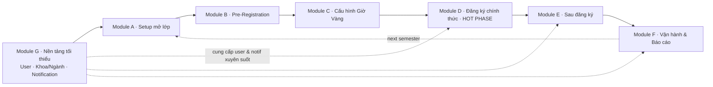

# Kế hoạch tập trung vào lõi ĐĂNG KÝ HỌC PHẦN — EduPort

> Định hướng lại: đồ án này **hệ thống đăng ký học phần**, vậy 100% task phải xoay quanh **vòng đời đăng ký**, không lan sang các phụ trợ.
>
> So với plan slim trước (22 task tản mát) → bản này có **6 Module + 28 task**: 5 module nghiệp vụ xoay quanh đăng ký (A→F) **+ Module G "nền tảng tối thiểu"** (User/Khoa/Ngành/Notification — đầu vào bắt buộc cho đăng ký vận hành).
>
> **Mục tiêu demo 15 phút bảo vệ**: kể được câu chuyện end-to-end:
> 1. Admin chuẩn bị HK mới → mở lớp → cấu hình giờ vàng
> 2. SV khảo sát nhu cầu (pre-reg) → Admin tinh chỉnh slot
> 3. **Đến giờ G: 100 SV cùng nhấn "Đăng ký" → Go queue + Java validation → DB** (đỉnh điểm kỹ thuật)
> 4. SV thanh toán → in TKB → Admin chặn thi nếu nợ
> 5. Admin xem báo cáo + audit toàn vòng

---

## Bản đồ module



**Quy tắc giữ task quản lý**:
- **GIỮ** nếu là **input bắt buộc** cho 1 trong 5 phase đăng ký (tạo user để đăng ký, tạo HP/Khoa/Ngành để mở lớp, gửi notification giờ G…).
- **CẮT** nếu chỉ phụ trợ ngoài đăng ký (nhập điểm có trọng số, ký số chốt điểm, lịch thi, học bổng, deep advisory…).

---

# MODULE G — Nền tảng tối thiểu (chạy song song toàn dự án)

> Không thuộc 5 phase đăng ký nhưng là **input bắt buộc**. Giữ ở mức **vừa đủ** để hệ thống vận hành, không over-engineer.

## G1. CRUD Khoa + Ngành đào tạo  
**Effort**: S · **Ưu tiên**: P0

- DB: dùng entity `Khoa`, `NganhDaoTao` đã có. Thêm cờ `active`.
- Backend: `KhoaController`, `NganhDaoTaoController` đã có GET; bổ sung `POST/PUT/DELETE` (`@PreAuthorize("hasRole('ADMIN')")`).
- Frontend: 1 page gộp `AdminKhoaNganhPage.jsx` `/admin/master/khoa-nganh` (2 tab Khoa & Ngành).
- DoD: tạo Khoa → tạo Ngành thuộc Khoa → dropdown Khoa/Ngành ở các page khác cập nhật.
- **Lý do giữ**: SV/GV phải gắn vào Khoa+Ngành mới chạy được Validation (tiên quyết theo CTĐT) và Cố vấn HT (lọc SV theo Khoa GV).

## G2. CRUD User + tạo SV/GV thủ công + reset password  
**Effort**: M · **Ưu tiên**: P0

- DB: dùng `User` đã có. Bổ sung cột `must_change_password BOOLEAN DEFAULT false`. Migration `migration_user_basic_sprintR1.sql`.
- Backend:
  - DTO: `AdminCreateUserRequest(username, fullName, email, role, khoaId?, nganhId?, lopId?, mssv?)`.
  - Khi role=STUDENT: auto tạo bản ghi `SinhVien` + `HoSoSinhVien` rỗng.
  - Khi role=LECTURER: auto tạo `GiangVien` gắn `khoaId`.
  - Sinh password tạm random, trả về cho admin in giấy.
  - Endpoint:
    - `POST /api/v1/admin/users`
    - `GET /api/v1/admin/users?role=&q=&page=`
    - `PATCH /api/v1/admin/users/{id}/lock`/`unlock`
    - `POST /api/v1/admin/users/{id}/reset-password`
- Frontend: page `AdminUserManagementPage.jsx` `/admin/users` — list + filter role + modal create.
- DoD: tạo 1 SV mới qua UI → SV login bằng password tạm → đăng ký được.
- **Không làm** (cắt vì over-engineer cho đồ án): password policy, forgot password email, SSO, device manager, auto-logout — JWT + MFA + RBAC sẵn có là đủ.
- Bulk import 200 SV xem **F3** (đã có trong Module F).

## G3. Notification infrastructure + Inbox + chuông  
**Effort**: M · **Ưu tiên**: P0 · **Tiền đề cho F4**

- DB: dùng entity `NotificationQueue` đã có. Bổ sung cột `category VARCHAR(20)` (`SYSTEM|REGISTRATION|FINANCE|EXAM`), `link_url VARCHAR(255)`, `read_at TIMESTAMP`. Migration `migration_notification_inbox_sprintR1.sql`.
- Backend:
  - Service `INotificationService`:
    - `enqueue(userId, category, title, body, linkUrl)`
    - `enqueueByRole(role, ...)`, `enqueueByKhoaHoc(khoaHoc, ...)` (đẩy theo khóa K59/K60…)
    - `markRead(id, userId)`, `markAllRead(userId)`
  - Controller `NotificationController`:
    - `GET /api/v1/notifications/me?unread=&page=`
    - `PATCH /api/v1/notifications/{id}/read`
    - `PATCH /api/v1/notifications/me/read-all`
- Frontend:
  - Component `NotificationBell.jsx` (chuông + badge unread, poll 30s) gắn vào header `AdminLayout`, `StudentLayout`, `TeacherLayout`.
  - Page `NotificationInboxPage.jsx` reuse cho `/student/inbox`, `/teacher/inbox`, `/admin/inbox`.
- DoD: backend đẩy 1 notif → chuông SV thấy badge +1 → click vào Inbox đọc → badge giảm.
- **Lưu ý**: SMTP thật **không làm** — vẫn log demo cho OTP. Inbox in-app là đủ cho đồ án.

## G4. (Đã có) RBAC + MFA + JWT — chỉ kiểm tra & hoàn thiện  
**Effort**: S · **Ưu tiên**: P0

- Đã hoàn thành Task 20–22 trong `Task_Prioritization.md`. Chỉ cần:
  - Verify `@PreAuthorize` trên tất cả endpoint mới của plan này.
  - Đảm bảo Validation chain (D3/D4) chạy với `currentUser` từ JWT.
- DoD: SV A không xem được transcript của SV B (HTTP 403).

---

# MODULE A — Setup mở lớp (Admin chuẩn bị HK)

> Đầu vào của toàn bộ vòng đăng ký. Hiện tại có nhưng UI thưa.

## A1. Mở/đóng học kỳ + cờ active  
**Effort**: S · **Ưu tiên**: P0

- DB: dùng `HocKy`; bổ sung cột `active BOOLEAN`, `dang_ky_mo BOOLEAN`. Migration `migration_hoc_ky_active_sprintR1.sql`.
- Backend: `AdminHocKyController`:
  - `POST /api/v1/admin/hoc-ky` (tạo)
  - `PATCH /api/v1/admin/hoc-ky/{id}/activate` (set active duy nhất 1)
  - `PATCH /api/v1/admin/hoc-ky/{id}/lock-registration` (đóng đăng ký giữa kỳ)
- Frontend: `AdminHocKyPage.jsx` `/admin/master/hoc-ky` — bảng + nút active/lock.
- DoD: SV chỉ thấy đăng ký ở HK active; HK cũ readonly.

## A2. CRUD Học phần với tiên quyết (form chứ không drag-drop)  
**Effort**: M · **Ưu tiên**: P0

- DB: bảng `hp_tien_quyet(hp_id, prereq_hp_id)` (đã có check trong validation chain). Migration `migration_hp_prereq_sprintR1.sql`.
- Backend: `AdminHocPhanController` mở rộng `POST/PUT/DELETE` + endpoint `PUT /api/v1/admin/hoc-phan/{id}/tien-quyet` body `{prereqIds: [...]}`.
- Frontend: `AdminHocPhanPage.jsx` `/admin/master/hoc-phan` — bảng + dialog "Tiên quyết" (multi-select autocomplete).
- DoD: SV đăng ký môn chưa qua tiên quyết → bị Validation chain reject với message rõ.

## A3. Mở lớp HP + phân GV + cấu hình slot/sĩ số  
**Effort**: M · **Ưu tiên**: P0

- Tận dụng `LopHocPhan` đã có. Backend đã có `AdminClassPublishController` + `LopHocPhanAssignGiangVienRequest`.
- Bổ sung UI thật: page `AdminClassPublishPage.jsx` (đã có khung) cần **bảng grid theo HK + nút Bulk publish + modal phân GV**.
- DTO: `LopHocPhanCreateRequest(maHp, hocKyId, soSlot, gvId, thoiKhoaBieuJson, phongHocId)`.
- DoD: 1 click admin tạo được 50 lớp cho HK mới (clone từ HK trước).

## A4. CRUD Phòng học + Slot/Tiết (route hóa controller có sẵn)  
**Effort**: S · **Ưu tiên**: P1

- Backend đã có `AdminPhongHocController`, `AdminSchedulingSlotController`. Chỉ cần **2 page FE** + sidebar link.
- Page: `AdminPhongHocPage.jsx`, `AdminSlotPage.jsx`.
- DoD: chọn `phong_hoc_id` + `slot_id` được trong A3.

## A5. (BONUS) Clone lớp từ HK trước  
**Effort**: S · **Ưu tiên**: P2

- Endpoint `POST /api/v1/admin/lop-hoc-phan/clone?fromHocKyId=&toHocKyId=` → copy toàn bộ LHP, reset slot, reset registration.
- Tiết kiệm 90% công admin → đáng giá demo.

---

# MODULE B — Pre-Registration (khảo sát nhu cầu)

> Đã có nền: `PreRegistrationIntent`, `PreRegistrationCartController`, `AdminPreRegistrationDemandController`. Cần khép vòng "demand → quyết định mở thêm lớp".

## B1. SV gửi/sửa Pre-Reg Intent (đã có) — POLISH UI  
**Effort**: S · **Ưu tiên**: P0

- Page `TnhNngTrcGiGPreRegistrationGiLp.jsx` đã có. Bổ sung:
  - Cảnh báo conflict TKB trong giỏ (đã có util `TkbSlotConflictUtils`).
  - Hiển thị "Slot dự kiến còn lại" theo Admin đang mở.
- DoD: SV nhìn thấy danh sách lớp + thêm/bớt giỏ + cảnh báo trùng giờ.

## B2. Admin xem demand heatmap theo HP (đã có) — POLISH  
**Effort**: S · **Ưu tiên**: P0

- Page `AdminPreRegistrationDemandPage.jsx` đã có. Bổ sung:
  - Cột "Số lớp đã mở" / "Slot tổng" / "Demand / Capacity %".
  - Dòng đỏ khi `demand > capacity * 1.2` → đề xuất mở thêm.
- DoD: trên 1 màn hình admin biết HP nào "cháy vé".

## B3. Action "Mở thêm lớp" 1-click từ trang demand  
**Effort**: S · **Ưu tiên**: P1

- Backend: `POST /api/v1/admin/pre-registration/demand/{maHp}/open-additional` body `{soSlot, gvId, slotId, phongHocId}` → tạo LopHocPhan mới + publish.
- Frontend: nút "Mở thêm lớp" trong dòng demand → modal nhập GV/phòng/slot.
- DoD: từ demand → tạo lớp → SV thấy ngay trong giỏ.

## B4. Convert giỏ pre-reg → đăng ký chính thức khi tới giờ G  
**Effort**: M · **Ưu tiên**: P0

- Khi `RegistrationWindow` mở: SV nhấn 1 nút "Đăng ký toàn bộ giỏ" → đẩy mỗi item vào Kafka queue (qua Go service).
- Backend: `POST /api/v1/pre-reg/cart/me/submit-all` → produce nhiều message Kafka.
- Frontend: nút "Đăng ký giỏ" lớn, hiển thị confirm trước khi gửi.
- DoD: SV gom giỏ trước → đến giờ G nhấn 1 phát đăng ký đồng loạt → từng môn nhận về kết quả ✅/❌.

---

# MODULE C — Cấu hình Giờ Vàng

> Đã có `RegistrationWindow` + monitoring. Cần khép vòng vận hành thực sự.

## C1. CRUD Registration Window theo khóa (đã có) — POLISH  
**Effort**: S · **Ưu tiên**: P0

- Page `AdminRegistrationWindowsPage.jsx` đã có. Bổ sung:
  - Validate: 2 window cùng khóa không được chồng giờ.
  - Phân khóa K59 8:00 / K60 13:00 / K61 17:00 — hiển thị timeline.
- DoD: admin thấy được 1 timeline ngày mở cửa.

## C2. Kill-switch giờ vàng + banner bảo trì broadcast  
**Effort**: M · **Ưu tiên**: P0

- DB: bảng `system_flag(key, value, message, updated_at, updated_by)`. Migration `migration_system_flag_sprintR1.sql`.
- Backend:
  - Filter `RegistrationKillSwitchInterceptor` chặn `POST /api/v1/registrations/*` nếu cờ on → 503 với `code=MAINTENANCE`.
  - Endpoint `POST /api/v1/admin/ops/kill-switch` `{enable, message}`.
- Frontend:
  - Nút STOP đỏ + ô message trên `AdminRegistrationMonitoringPage.jsx`.
  - Banner bảo trì hiển thị ở `RequireAuth` khi nhận 503 `MAINTENANCE`.
- DoD: admin nhấn STOP → toàn hệ thống SV không submit được, hiện banner.

## C3. Pre-warm slot vào Redis trước giờ G + smoke test  
**Effort**: M · **Ưu tiên**: P1

- Endpoint Go service: `POST /admin/slots/preload?hocKyId=` → đọc tất cả `LopHocPhan.so_slot` đẩy vào Redis key `slot:{lhpId}`.
- Cron 5 phút trước giờ G tự gọi.
- Frontend admin: nút "Preload Redis" + countdown.
- DoD: ngay trước giờ G mở, Redis đã có đủ counter; tránh race condition khởi đầu.

## C4. Test capacity (JMeter / k6 script) — báo cáo  
**Effort**: M · **Ưu tiên**: P1 (cho báo cáo, không cho UI)

- Viết `scripts/loadtest/registration.k6.js`: 500 SV ảo cùng đăng ký 1 lớp 30 slot trong 10 giây.
- Output: bảng latency p50/p95/p99 + success rate.
- Chèn vào báo cáo: chứng minh "kỹ thuật cốt lõi" hoạt động.

---

# MODULE D — Đăng ký chính thức (HOT PHASE) — KỸ THUẬT NHẤT

## D1. Dashboard SV: countdown giờ G + status đăng ký realtime  
**Effort**: M · **Ưu tiên**: P0

- Backend tạo endpoint compose:
  - `GET /api/v1/student/registration-status/me` trả: `{currentWindow, isOpenForMe, secondsUntilOpen, registeredCount, cartCount, kafkaPendingCount}`.
- Frontend: `DashboardSinhVinTrangCh.jsx` thêm widget lớn ở đầu:
  - Countdown đến `secondsUntilOpen`.
  - Khi mở: badge xanh "Đang đăng ký được".
  - Khi maintenance: badge đỏ.
- DoD: SV vào dashboard thấy ngay trạng thái cổng.

## D2. Tìm môn + giỏ + LỌC GIỜ RẢNH  
**Effort**: M · **Ưu tiên**: P0

- Backend mở rộng `CourseSearchSpecification`:
  - Filter `freeSlots` (List<{thu, ca}>): môn có TKB **chỉ chứa** trong tập slot rảnh.
  - Filter `chiConCho`: lọc lớp còn slot (đọc Redis).
- Frontend: `TnhNngLcMnnhCao.jsx` panel checkbox 6 ngày × 6 ca.
- DoD: SV chọn "Sáng T2/T4/T6 rảnh" → list rút gọn còn ~20% môn.

## D3. Submit registration → Validation chain (đã có) — TĂNG TRẢI NGHIỆM  
**Effort**: M · **Ưu tiên**: P0

- Hiện status: backend đã có chain (Duplicate → Conflict → Prereq) + Kafka.
- Bổ sung:
  - Endpoint polling `GET /api/v1/registrations/me/recent?limit=20` trả các result mới nhất với `outcome` (`SUCCESS|REJECTED_REASON_X`).
  - Frontend: toast notification cho từng item, log trong panel "Lịch sử request".
- DoD: SV submit → trong 1–2s thấy ✅/❌ với lý do (slot full / trùng / chưa qua tiên quyết / vượt 22 TC / nợ HP cũ).

## D4. Rule "vượt 22 TC / dưới 14 TC / nợ HP cũ" (Module 3.3 đặc tả)  
**Effort**: M · **Ưu tiên**: P0

- Bổ sung vào Validation chain (đã có 3 handler):
  - `CreditCapHandler`: tổng `tin_chi` của HK đăng ký + đang đăng ký mới ≤ 22, ≥ 14 (cảnh báo, không chặn nếu là HK cuối).
  - `OutstandingDebtHandler`: nếu `tongCongNoHKCu > 0` → reject `REGISTRATION_BLOCKED_DEBT`.
- Backend: 2 class handler mới trong `service/validation/handler/`.
- Frontend: pop-up cảnh báo trước khi submit nếu sắp vượt 22 TC.
- DoD: SV nợ HK cũ không đăng ký được; tổng TC bị chặn đúng.

## D5. Realtime monitoring admin (đã có) — POLISH  
**Effort**: S · **Ưu tiên**: P1

- Page `AdminRegistrationMonitoringPage.jsx` đã có. Bổ sung:
  - Biểu đồ throughput per minute.
  - Top 10 LHP đầy slot nhanh nhất.
  - Bảng `RegistrationRequestLog` filter theo outcome.
- DoD: admin theo dõi sống được luồng đăng ký.

## D6. Realtime slot countdown trên trang search (polling 3s, không WebSocket)  
**Effort**: S · **Ưu tiên**: P1

- Frontend: trên trang tìm môn / giỏ, refetch slot mỗi 3s qua endpoint nhẹ `GET /api/v1/courses/slot-snapshot?lhpIds=...` (đọc Redis batch).
- Backend: 1 endpoint mới đọc `MGET` Redis.
- DoD: SV thấy slot giảm "sống" mà không cần F5.

---

# MODULE E — Sau đăng ký

## E1. Rút môn trong hạn (đã có) — POLISH  
**Effort**: S · **Ưu tiên**: P0

- Endpoint hiện có. Bổ sung:
  - Confirm dialog "Bạn sẽ được hoàn lại X TC + Y VNĐ".
  - Audit `REG_DROP`.
- DoD: SV rút môn ngay sau đăng ký → slot trả về Redis + ví được hoàn.

## E2. Đơn rút môn TRỄ HẠN (3 cấp duyệt CV → PDT)  
**Effort**: L · **Ưu tiên**: P0

- DB: bảng `don_rut_mon_tre(id, sv_id, dang_ky_id, ly_do, evidence_url, status[PENDING_CV|PENDING_PDT|APPROVED|REJECTED], cv_id, cv_reviewed_at, cv_note, pdt_id, pdt_reviewed_at, created_at)`. Migration `migration_don_rut_mon_tre_sprintR2.sql`.
- Backend:
  - SV: `POST/GET /api/v1/student/late-drop`
  - CV: `GET/PATCH /api/v1/lecturer/advisory/late-drop`
  - Admin: `GET/PATCH /api/v1/admin/late-drop`
- Khi APPROVED: gọi `DangKyHocPhanService.adminForceDrop(dangKyId)` → trả slot Redis + đánh dấu DangKy `RUT_TRE`.
- Frontend: 3 page tương ứng.
- DoD: 1 đơn chạy được full pipeline + áp tác dụng.

## E3. Thanh toán học phí (đã có) — POLISH  
**Effort**: S · **Ưu tiên**: P0

- Endpoint hiện có (`PaymentController`, `WalletController`). Bổ sung:
  - Sau đăng ký thành công, tự động tạo bill = sum(`tinChi` * giaTinChi).
  - Endpoint `POST /api/v1/student/auto-clear-debt` → trừ ví vào nợ.
- DoD: SV đăng ký xong → ví trừ tự động nếu đủ; nếu không đủ → hiện QR thanh toán.

## E4. Hóa đơn điện tử PDF  
**Effort**: M · **Ưu tiên**: P1

- Backend: lib `openhtmltopdf`. Service `IPdfRenderService.renderInvoice(payment)`.
- Endpoint `GET /api/v1/payments/{id}/invoice.pdf`.
- Frontend: nút Download trên `ThanhTonQrCodeOpenApi.jsx` + history ví.
- DoD: tải được PDF đẹp với mã QR.

## E5. Blacklist nợ HP → chặn đăng ký HK kế tiếp  
**Effort**: M · **Ưu tiên**: P0

- Backend:
  - Service `BlacklistService.computeForHocKy(hocKyId)` → list SV nợ.
  - Hook vào `OutstandingDebtHandler` (D4) — đọc cùng nguồn.
  - Endpoint admin: `GET /api/v1/admin/finance/blacklist?hocKyId=`, `POST .../export.csv`.
- Frontend: tab "Nợ HP" trên `GimStTiChnhKTonAdmin.jsx`.
- DoD: SV nợ HK 2024-1 không đăng ký được HK 2024-2.

## E6. Xuất TKB cá nhân: PDF + iCal `.ics`  
**Effort**: M · **Ưu tiên**: P1

- Backend:
  - `GET /api/v1/timetable/me/export.pdf` (dùng PDF util từ E4).
  - `GET /api/v1/timetable/me/export.ics` (lib `biweekly` hoặc tự gen text).
- Frontend: 2 nút trên `DchVThiKhaBiuThngMinh.jsx`.
- DoD: file `.ics` import vào Google Calendar hiển thị đúng.

---

# MODULE F — Vận hành & Báo cáo

## F1. Audit registration mở rộng  
**Effort**: M · **Ưu tiên**: P1

- Hook AuditTrail vào: `REG_SUBMIT`, `REG_SUCCESS`, `REG_REJECTED_<reason>`, `REG_DROP`, `REG_LATE_DROP`, `WINDOW_KILL`, `WINDOW_RESUME`.
- Filter trên `LchSNhtKDuChnAuditTrailsLogging.jsx`: thêm action group "Đăng ký".
- DoD: trace 1 SV từ submit → result → rút.

## F2. Báo cáo tổng kết đăng ký theo HK  
**Effort**: M · **Ưu tiên**: P1

- Backend `GET /api/v1/admin/analytics/registration-summary?hocKyId=` trả:
  - Tổng đăng ký, success rate, avg latency, peak QPS.
  - Top HP cháy vé, top HP vắng.
  - SV đăng ký nhiều/ít TC nhất.
- Frontend: tab "Báo cáo đăng ký" trên `BoCoPhnTchAnalytics.jsx`.
- DoD: 1 trang gói được toàn bộ "diễn tiến HK".

## F3. Import SV Excel (cho dataset demo Giờ Vàng)  
**Effort**: M · **Ưu tiên**: P0

- Backend: lib Apache POI. Endpoint `POST /api/v1/admin/import/sinh-vien` multipart.
- Tạo User role STUDENT với password tạm.
- Frontend: page `AdminImportSinhVienPage.jsx`.
- DoD: import 200 SV → đủ dataset chạy load test C4.

## F4. Notification + bulletin về giờ vàng  
**Effort**: M · **Ưu tiên**: P1

- DB: dùng `NotificationQueue` đã có entity (chưa có UI). Bổ sung cột `category, link_url`.
- Backend: Service `INotificationService` + 2 endpoint `GET /me`, `PATCH /{id}/read`.
- Tự động enqueue: 24h trước giờ G → bulletin "K59 mở 8:00 ngày X". Sau khi đăng ký → notif "Đã đăng ký HP X thành công".
- Frontend: chuông trên header Layout + page `NotificationInboxPage.jsx`.
- DoD: SV nhận được notif tự động đúng thời điểm.

---

# Lịch triển khai 4 tuần (1 dev solo) hoặc 2.5 tuần (2 dev)

| Tuần | Mục tiêu | Task |
|---|---|---|
| **Tuần 1** | Nền tảng + Setup HK + Mở lớp | **G1, G2, G3, G4**, A1, A2, A3, A4, A5, F3 |
| **Tuần 2** | Pre-Reg + Cấu hình giờ vàng | B1, B2, B3, B4, C1, C2, C3, C4 |
| **Tuần 3** | HOT PHASE — đăng ký chính thức | D1, D2, D3, D4, D5, D6 |
| **Tuần 4** | Sau đăng ký + Báo cáo | E1, E2, E3, E4, E5, E6, F1, F2, F4 |

**Buffer**: 3 ngày cuối cùng = viết test + chuẩn bị slide demo + load test C4 chạy lại nhiều lần để có số đẹp đưa vào báo cáo.

---

# Kịch bản DEMO 15 phút khi bảo vệ

```text
[00:00–01:00] Giới thiệu kiến trúc Hybrid Java + Go + Redis + Kafka
[01:00–03:00] ADMIN: tạo HK 2026-1 → mở 5 LHP → cấu hình giờ vàng K59=8:00, K60=13:00
[03:00–05:00] SV: pre-reg intent → ADMIN xem demand → 1-click mở thêm lớp
[05:00–06:00] Pre-warm Redis (C3) — chạy script load test 200 SV ảo (C4) — show throughput live
[06:00–09:00] HOT PHASE thật:
  - 9 SV thật + 1 admin trên Zoom cùng nhấn Đăng ký
  - Show admin monitoring biểu đồ realtime
  - Show 1 SV bị reject vì trùng giờ → 1 SV bị reject vì hết slot
  - Show 1 SV nợ HP cũ → blocked
[09:00–10:30] ADMIN: kill-switch test 30 giây → resume
[10:30–12:00] SV: đăng ký xong → tự thanh toán bằng ví → tải hóa đơn PDF → tải iCal TKB
[12:00–13:30] SV: nộp đơn rút trễ → CV duyệt → ADMIN chốt → DangKy chuyển trạng thái RUT_TRE
[13:30–15:00] ADMIN: báo cáo HK → audit trail show full lịch sử
```

---

# Phân loại task quản lý: GIỮ vs CẮT

## ✅ GIỮ — task quản lý LÀ INPUT cho đăng ký
| Task | Module | Lý do bắt buộc |
|---|---|---|
| User CRUD + reset pass | G2 | Không có user thì không ai đăng ký |
| Khoa + Ngành CRUD | G1 | Validation tiên quyết theo CTĐT cần Khoa/Ngành |
| HP CRUD + tiên quyết | A2 | Validation chain phải có HP |
| HK CRUD + active | A1 | Đăng ký chỉ chạy ở HK active |
| GV CRUD (qua G2) | G2 | Mở lớp phải gán GV |
| Phòng + Slot CRUD | A4 | Mở lớp cần thoiKhoaBieuJson |
| Mở lớp + phân GV | A3 | Lớp là target đăng ký |
| Notification + Inbox | G3 | Thông báo giờ G + kết quả đăng ký |
| Audit trail | F1 | Bằng chứng pháp lý cho đăng ký |
| Ví + Thanh toán + Hóa đơn | E3, E4 | Khép vòng tiền với đăng ký |
| Blacklist nợ HP | E5 | Chặn đăng ký kỳ kế |
| Đơn rút trễ | E2 | Workflow chính thức rút sau giờ G |
| RBAC + MFA + JWT | G4 | Bảo mật mọi endpoint đăng ký |
| Báo cáo + analytics ĐK | F2 | Output cuối kỳ |

## ❌ CẮT — task quản lý KHÔNG vào lõi đăng ký
| Task | Lý do cắt |
|---|---|
| Cột điểm trọng số, Ký số chốt điểm | Thuộc module nhập điểm |
| Lịch thi, phiếu dự thi, gác thi, in bìa | Thuộc module khảo thí (sau đăng ký nhưng không phải đăng ký) |
| QR điểm danh động, Class Board | Thuộc module lớp giảng dạy của GV |
| Cảnh báo học vụ tự động | Phụ trợ học vụ |
| Đăng ký xét tốt nghiệp | Không phải đăng ký HP |
| Học bổng / Khen thưởng / Kỷ luật / Điểm rèn luyện | Không liên quan |
| Deep profile advisee + Note CV | Module cố vấn nâng cao |
| Approval đổi hồ sơ | Không phải đăng ký |
| Visual node CTĐT (drag-drop) | Quá phức tạp, dùng form select thay |
| Solver xếp lịch tự động UI | BE đã có, không cần FE để demo |
| Đơn bảo lưu / chuyển ngành / nghỉ học | Chỉ giữ Đơn rút trễ — đủ minh hoạ workflow |
| SSO / Device manager / Forgot pass / Auto-logout / i18n | Polish, không phô kỹ thuật |
| Webhook PG thật, Re-conciliation | Giữ MOCK — không cần URL public |
| Import GV Excel | Manual qua G2 đủ; chỉ Import SV cần (F3) vì cần dataset đông |

## Câu chốt cho hội đồng

> *"Đồ án định vị là **Hệ thống Đăng ký Học phần**. Các module quản lý liên quan (User, Khoa/Ngành, Học phần, Phòng, Notification, Audit, Tài chính cơ bản) được giữ ở mức tối thiểu vừa đủ làm INPUT/OUTPUT cho lõi đăng ký. Các module lân cận (Khảo thí, Nhập điểm có trọng số, Học bổng, Cố vấn nâng cao) thuộc backlog phase 2 — đã có entity/data model nhưng tạm thời không tích hợp UI để tập trung kỹ thuật cốt lõi (Hybrid Java+Go, Redis Lua, Kafka, Validation Chain)."*

---

# Checklist hành động ngay

- [ ] **Hôm nay**: chốt 24 task ID này (không thêm bớt giữa kỳ).
- [ ] **Ngày 1**: làm A1 + A2 (entity HK + HP đã có, chỉ thêm CRUD admin).
- [ ] **Ngày 2–3**: A3 + A4 + A5 (clone class).
- [ ] **Ngày 4–5**: F3 (import SV Excel) — phải có dataset trước khi vào module B/C/D.
- [ ] **Ngày 5 cuối tuần**: chạy thử pre-reg flow B1+B2.
- [ ] **Tuần 2 đầu**: ưu tiên C2 (kill-switch) + C3 (preload Redis) — vì là demo thuyết phục nhất.
- [ ] **Tuần 2 cuối**: viết script load test C4 ngay khi C3 xong.

---

# So sánh độ phủ với đặc tả gốc

| Đặc tả gốc (DOCS/Danh_Sach_Chuc_Nang.md) | Plan này | Status |
|---|---|---|
| 3.1 Pre-Registration giỏ hàng | B1, B4 | ✅ |
| 3.2 Lọc môn đỉnh cao | D2 | ✅ |
| 3.3 Validation Rules Engine 5 rule | D3, D4 | ✅ (bổ sung 2 rule còn thiếu) |
| 6.1 Setup giờ vàng | C1, C2, C3 | ✅ |
| 6.2 Quản lý mở lớp | A1, A2, A3, A4, A5 | ✅ |
| 4.1 Ví SV / 4.2 Thanh toán QR | E3, E4 | ✅ |
| 5.1 TKB iCal | E6 | ✅ |
| 6.3 Giám sát tài chính (chỉ phần liên quan đăng ký) | E5 | ✅ |
| 8.4 Audit trail liên quan đăng ký | F1 | ✅ |
| 1.1/1.2 Hồ sơ + Notification SV | G3 | ✅ Inbox in-app |
| 6.2 Master data (Khoa/Ngành/HP/HK/GV/Lớp) | G1, G2, A1–A5 | ✅ |
| 8.1/8.2/8.3 Auth + RBAC + MFA | G4 (đã có sẵn) | ✅ |

**Phủ 12/12 hạng mục đặc tả gốc liên quan trực tiếp + gián tiếp đến đăng ký học phần.**

---

# Bonus — checklist KHÔNG nằm trong plan này (để hội đồng hỏi không bị bí)

Nếu bị hỏi *"Sao thiếu chức năng X?"*, trả lời:

| Hỏi | Trả lời |
|---|---|
| "Sao không có nhập điểm trọng số?" | "Module nhập điểm đã có ở phase 1 (Task 17), bản plan này tập trung đăng ký nên không nâng cấp tiếp." |
| "Sao không có lịch thi tự động?" | "Module khảo thí có entity `LichThi`/`PhieuDuThi` và endpoint cho SV xem; phần admin tạo hàng loạt + phân gác để phase 2." |
| "Học bổng / khen thưởng?" | "Không thuộc phạm vi Đăng ký Học phần." |
| "SSO Email trường?" | "Đã hỗ trợ JWT + MFA + RBAC. SSO OAuth2 cần Google Workspace của trường — backlog." |
| "Real PG webhook?" | "Demo dùng MOCK + đối soát thủ công vì sandbox VNPay cần URL public." |
| "WebSocket realtime?" | "Polling 3s đủ p95 < 100ms; WebSocket là tối ưu, không bắt buộc." |
