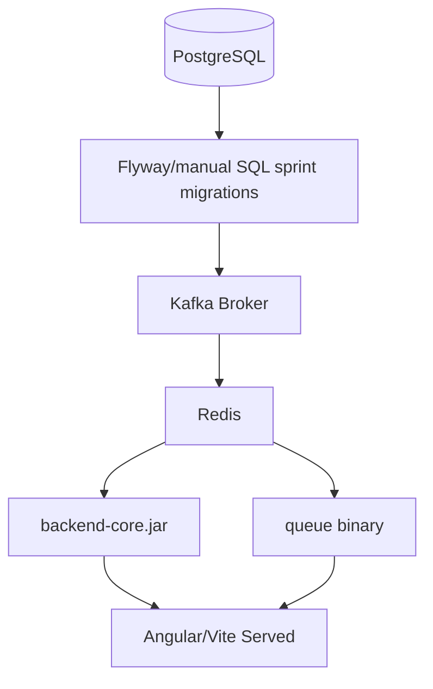

# C10 — Deployment Runbook (vận hành, cấu hình, kiểm tra health)

Đối tượng: Kỹ sư triển khai (hay chính sinh viên tự demo server lab). Env mục tiêu: **DEV local** và **staging mini single-node**.

> Không chứa secrets thực production — chỉ placeholders.

---

## 1) Inventories thành phần

| Component | Path repo | Artefact build |
|-----------|-----------|----------------|
| Java API | `backend-core` | `mvn package` jar |
| Go queue | `backend-queue` | `go build` binary |
| Frontend | `frontend` | `npm run build` → `dist/` |
| PostgreSQL | external/service | migrations SQL lists |
| Redis | external | ephemeral |
| Kafka | external Zookeeper/KRaft |

---

## 2) Biến môi trường cốt lõi (Java)

Đặt trong `.env`, `docker-compose.yml`, hoặc `application-{profile}.properties`.

| KEY | Meaning | Typical dev |
|-----|---------|-------------|
| `SPRING_DATASOURCE_URL` | JDBC | `jdbc:postgresql://localhost:5432/eduport_db` |
| `SPRING_DATASOURCE_USERNAME` | DB user | `eduport_user` seed |
| `SPRING_DATASOURCE_PASSWORD` | secret | ******** |
| `SPRING_JPA_HIBERNATE_DDL_AUTO` | schema | validate hoặc update (dev nhỏ); prod `validate/migrate` discipline |
| `SPRING_KAFKA_BOOTSTRAPSERVERS` | brokers | `localhost:9092` |
| JWT secret custom property | signer | không commit plain GitHub |

Xem cụ thể property keys trong `application.properties` của dự án (grep `jwt`/`kafka`).

---

## 3) Biến môi trường Go queue

Theo `backend-queue/config/config.go` (hàm `Load`).

| ENV | Default | Note |
|-----|---------|------|
| `SERVER_PORT` | 3000 | |
| `REDIS_ADDR` | localhost:6379 | Password default sample `eduport_redis` — rotate |
| `KAFKA_BROKER` | localhost:9092 | |
| `KAFKA_TOPIC` | eduport.dang-ky-hoc-phan | |
| `KAFKA_PREREG_TOPIC` | eduport.pre-registration-submitted | |

---

## 4) Thứ tự khởi động khuyến nghị



Lý do: consumer Java cần topic tồn tại để không fail loop trong một số cấu hình (tuỳ version).

---

## 5) Lệnh build nhanh (Windows PowerShell)

```powershell
cd "D:\docs do an\backend-core"
mvn -DskipTests package

cd "D:\docs do an\backend-queue"
go build -o eduport-queue.exe .

cd "D:\docs do an\frontend"
npm ci
npm run build
```

---

## 6) Kiểm tra health sau deploy

### 6.1 Java smoke

```
curl.exe http://localhost:8080/api/hoc-ky/hien-hanh
curl.exe -H "Authorization: Bearer <TOKEN>" ^
  http://localhost:8080/api/v1/registrations/me/window-status
```

### 6.2 Go ingress smoke

```
curl.exe http://localhost:3000/api/v1/queue/slot/1
```

Expect JSON shape or 404 if key missing narrated.

### 6.3 Frontend

Navigate `/login`, ensure bundle loads no console RED errors referencing env var missing `VITE_API_BASE_URL`.

---

## 7) Migration SQL áp vào Postgres (không Hibernate auto prod)

Đường dẫn tham khảo:

- `migration_registration_window_sprint1.sql`
- `migration_pre_registration_intent_sprint2.sql`
- `migration_registration_request_log_sprint4.sql`
- `migration_lop_hoc_phan_publish_sprint3.sql`
- `migration_student_timetable_entry_sprint5.sql`

**Quy trình**: backup DB → áp incremental → `\d registration_window` sanity.

---

## 8) Troubleshooting playbook (ops)

### 8.1 Lỗi consumer Kafka không consume

Kiểm:

1. Topic tồn tại (`kafka-topics --list`).
2. Group id property matches `spring.kafka.consumer.group-id`.
3. Network ACL — container DNS.

### 8.2 Slot Redis không giảm

Key naming mismatch — introspect code `QueueService`.

### 8.3 CORS browser block

Đảm bảo frontend origin được list WebSecurity Java; hoặc use dev proxy vite.

---

## 9) Rotating secrets checklist

Không được commit:

- Postgres superuser pwd
- Redis AUTH
- JWT signing key symmetrical

Use `.env.example` placeholders only publicly.

---

## 10) Minimum production delta (future)

| Capability | Requirement |
|------------|--------------|
| TLS termination | nginx certbot |
| HSTS | nginx header |
| Autoscaling Ingress | Horizontal Pod Autoscaling CPU > 60% |
| Central logging | Elasticsearch / Loki |
| Secrets | Vault or cloud secret manager |

Not implemented in toy repo – document roadmap.
