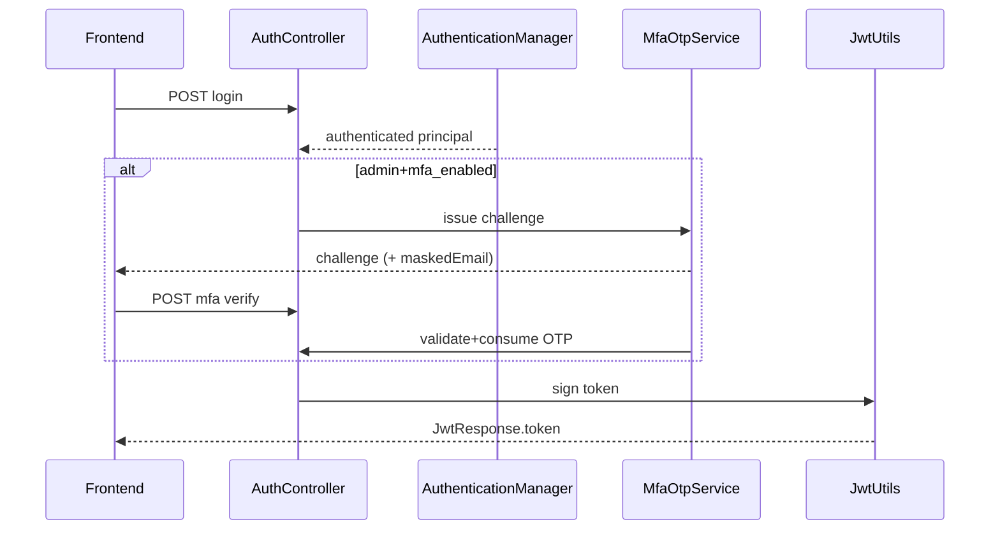

# Dev-Spec — F01 Auth (JWT filter + MFA email OTP Task 22)

| Trường | Giá trị |
|--------|---------|
| Mã chức năng | F01 |
| BA-Flow | [`ba_flow.md`](ba_flow.md) |
| Modules | `backend-core` security package; MFA services |
| Frontend | `frontend/src/config/api.js`, `RequireAuth.jsx`, login pages `/login` |
| Stateless | không server session table (ngoài MFA challenge TTL rows) |

---

## 1) Kiến trúc Spring Security

| Layer | Class | Vai trò |
|-------|-------|---------|
| Filter chain | [`WebSecurityConfig`](../../../../backend-core/src/main/java/com/example/demo/security/WebSecurityConfig.java) | Whitelist `/api/auth/**`, các route public học kỳ & `lop-hoc-phan` list chi tiết trong file |
| JWT filter | [`AuthTokenFilter`](../../../../backend-core/src/main/java/com/example/demo/security/jwt/AuthTokenFilter.java) | Parse Bearer, validate signature + exp, hydrate `SecurityContext` |
| Encoder | Bean `PasswordEncoder` BCrypt | Hash password trong seed & login compare |

JWT generation utilities: [`JwtUtils`](../../../../backend-core/src/main/java/com/example/demo/security/jwt/JwtUtils.java).

User principal: [`UserDetailsImpl`](../../../../backend-core/src/main/java/com/example/demo/security/services/UserDetailsImpl.java):

```pseudo
GrantedAuthority = ROLE_<user.getRole().name()>
```

---

## 2) Domain tables / entities quick

[`User`](../../../../backend-core/src/main/java/com/example/demo/domain/entity/User.java): `username`,`password`(hash), enum `Role` {STUDENT,LECTURER,ADMIN}, `email`, flags `mfaEnabled`.

Challenge storage: [`MfaOtpChallenge`](../../../../backend-core/src/main/java/com/example/demo/domain/entity/MfaOtpChallenge.java) + repo.

---

## 3) API surface (`AuthController`)

Base `/api/auth` (**permitAll** at security config level — confirm file).

### 3.1 `POST /api/auth/login`

Body [`LoginRequest`](../../../../backend-core/src/main/java/com/example/demo/payload/request/LoginRequest.java):

```json
{ "username": "...", "password": "..." }
```

Response union:

**A.** [`JwtResponse`](../../../../backend-core/src/main/java/com/example/demo/payload/response/JwtResponse.java) fields:

| Field | Ý |
|-------|---|
| `token` | compact JWT HS512 (verify impl JwtUtils) |
| `roles` array | ví dụ `ROLE_STUDENT` |

**B.** [`MfaLoginChallengeResponse`](../../../../backend-core/src/main/java/com/example/demo/payload/response/MfaLoginChallengeResponse.java) (`requiresMfa=true`).

Failure: **401** standard.

### 3.2 `POST /api/auth/mfa/verify`

Body [`MfaVerifyRequest`](../../../../backend-core/src/main/java/com/example/demo/payload/request/MfaVerifyRequest.java): `challengeId` UUID style + `otp` 6-digit string.

Returns final **JwtResponse** or error (invalid consumed challenge).

Implementation service [`MfaOtpServiceImpl`](../../../../backend-core/src/main/java/com/example/demo/service/impl/MfaOtpServiceImpl.java) + OTP delivery abstraction [`MfaOtpDelivery`](../../../../backend-core/src/main/java/com/example/demo/service/impl/MfaOtpDelivery.java) (**log WARN** prod placeholder).

TTL property: **`eduport.mfa.otp-ttl-minutes`**.

### 3.3 `POST /api/auth/seed` (dev bootstrap)

Dangerous publicly if exposed beyond dev — chỉ được allow profile dev.

Admin MFA settings controllers (quan hệ RBAC ADMIN) nằm ngoài F01 lõi nhưng liên quan Task 22: [`AdminMfaController`](../../../../backend-core/src/main/java/com/example/demo/controller/AdminMfaController.java).

---

## 4) Error envelopes

Chi tiết format global: [`cross/04_api_catalog.md`](../../cross/04_api_catalog.md).

---

## 5) JWT claims (recommended doc for thesis appendix)

JWT payload chứa tối thiểu `sub=username`. Extended claims if any (**iat**, **exp**) — cite `JwtUtils.createToken` method.

Clock skew OTP vs server TTL: QA across containers.

---

## 6) Sequence diagram — MFA variant



---

## 7) Threat / limitation honesty

| Risk | Mitigation status |
|------|-------------------|
| Brute OTP | TTL + hashing + single consume — brute force backlog rate limit LB |
| Stolen JWT | No server-side revocation list unless extend blacklist |
| Log leak OTP | Demonstration WARN logs — prod must SMTP hardened |

[`EmailMaskUtil`](../../../../backend-core/src/main/java/com/example/demo/util/EmailMaskUtil.java) masking.

---

## 8) Frontend contract

```javascript
Authorization: Bearer ${token}`
```

Logout removes storage.

Routes guard compares `roles` array from JWT decode (**client**) — không thay RBAC backend.

Utility: **`hasAnyRole`**, **`authHeaders`** in `frontend/src/config/api.js` (path relative repo).

---

## 9) Test script

Manual:

```
POST /login sv01 → expect roles ROLE_STUDENT
POST /login admin mfa_off → ADMIN
Admin MFA simulation if toggled seed
```

Suggested automated: `@WebMvcTest` slice `AuthController` with mocked MFA.

---

## 10) Bibliography của code artifacts

Đường dẫn nhanh (repo root prefixes):

[`AuthController.java`](../../../../backend-core/src/main/java/com/example/demo/controller/AuthController.java)

[`JwtUtils.java`](../../../../backend-core/src/main/java/com/example/demo/security/jwt/JwtUtils.java)

[`WebSecurityConfig.java`](../../../../backend-core/src/main/java/com/example/demo/security/WebSecurityConfig.java)

[`MfaOtpChallengeRepository`](../../../../backend-core/src/main/java/com/example/demo/repository/MfaOtpChallengeRepository.java)

---

## 11) Lịch sử

| Ngày | |
|------|--|
| 2026-05 | Baseline MFA Task 22 |
| 2026-05 | Expanded MFA sequence + JWT layer table |
