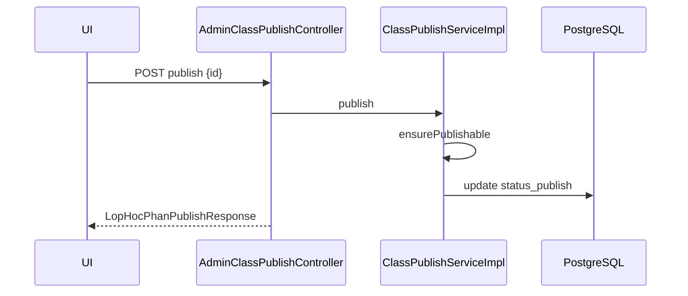

# Dev-Spec — F03 Admin class publish workflow

| Mã | F03 |
|----|-----|
| BA | [`ba_flow.md`](ba_flow.md) |
| Controller | [`AdminClassPublishController`](../../../../backend-core/src/main/java/com/example/demo/controller/AdminClassPublishController.java) |
| Service | [`IClassPublishService`](../../../../backend-core/src/main/java/com/example/demo/service/IClassPublishService.java) → [`ClassPublishServiceImpl`](../../../../backend-core/src/main/java/com/example/demo/service/impl/ClassPublishServiceImpl.java) |
| Base path | **`/api/v1/admin/lop-hoc-phan`** |

---

## 1) Tóm tắt kỹ thuật

`ClassPublishServiceImpl` điều phối:

1. **`assignGiangVien(idLopHp, req)`**: set FK `giang_vien`, conflict nếu PUBLISHED, optional auto SCHEDULE khi có lịch.
2. **`publish(idLopHp)`**: `ensurePublishable` (GV schedule non-empty) → `statusPublish=PUBLISHED`.
3. **`bulkPublish(hocKyId)`**: iterate eligible lessons in HK and collect successes/fail buckets.
4. **`forcePublishAll(hocKyId)`**: không guard — đặt hàng loạt + [`trang_thai`](../../../../backend-core/src/main/java/com/example/demo/domain/entity/LopHocPhan.java) **`DANG_MO`** (business demo).

Chi tiết line-by-line: đọc source file trong IDE khi chỉnh sửa không lệch với QA.

---

## 2) API contract

Authentication: **`@PreAuthorize("hasRole('ADMIN')")`** ALL routes.

### 2.1 `POST /{idLopHp}/assign-giang-vien`

JSON [`LopHocPhanAssignGiangVienRequest`](../../../../backend-core/src/main/java/com/example/demo/payload/request/LopHocPhanAssignGiangVienRequest.java):

```json
{ "idGiangVien": 12 }
```

**200** [`LopHocPhanPublishResponse`](../../../../backend-core/src/main/java/com/example/demo/payload/response/LopHocPhanPublishResponse.java):

| Response field highlights | Purpose |
|---------------------------|---------|
| `statusPublish`, `hasSchedule`, `version` | UI refresh |
| `message` | human friendly note (auto-promote etc.) |

### 2.2 `POST /{idLopHp}/publish`

Body none.

**422** `ResponseStatusException` khi không publishable giống UX message string.

### 2.3 `POST /bulk-publish?hocKyId={id}`

**200** [`LopHocPhanBulkPublishResponse`](../../../../backend-core/src/main/java/com/example/demo/payload/response/LopHocPhanBulkPublishResponse.java):

Field summary:

| Field | Meaning |
|-------|---------|
| `totalRequested`, `publishedCount`, `skippedCount` | Batch stats |
| `publishedIds` | Success id list ordering arbitrary |
| `skipped` | Nested records `{ idLopHp, maLopHp, reason }` |

### 2.4 `POST /force-publish-all?hocKyId={id}`

**200** Same response type semantics but mass operation.

JavaDoc warns not for production morality.

---

## 3) State machine (documentation form)

```
SHELL --(+GV + có lịch auto)--> SCHEDULED --(publish)--> PUBLISHED
           \______________(force-publish-all bypass)____________/
```

**Không rollback** Sprint 3: không có downgrade `PUBLISHED → SCHEDULED` trong service public.

---

## 4) Lỗi HTTP

| Code | Scenario |
|------|-----------|
| 404 | GV / LHP not found references |
| 409 | Conflict assign after published |
| 422 | ensurePublishable fail |
| 200 | Bulk maybe partial successes — inspect skip list |

---

## 5) DB & entity

[`LopHocPhanPublishStatus`](../../../../backend-core/src/main/java/com/example/demo/domain/enums/LopHocPhanPublishStatus.java) enum persists as string column **`status_publish`**.

Companion JSON column **`thoi_khoa_bieu_json`** powering schedule detection & F06/F12 projections.

Migration file: **`migration_lop_hoc_phan_publish_sprint3.sql`**.

---

## 6) Sequence — publish một lớp



---

## 7) Regression checklist (`grep` không nhầm)

| Anti-pattern | Fix |
|--------------|-----|
| Gọi legacy `publishLop` route public `LopHocPhanController` không versioning | Chỉ dùng **`/api/v1/admin`** path |
| So sánh sai enum string case | Persist uppercase consistent |

---

## 8) Test

[`ClassPublishServiceImplTest`](../../../../backend-core/src/test/java/com/example/demo/service/impl/ClassPublishServiceImplTest.java).

Suggested extra cases backlog:

- Bulk returns skip array size matches expectation when half invalid.
- Force sets operational `trang_thai`.

---

## 9) Frontend notes

SPA admin must display **`skipped[].reason`** in table expandable row for QA transparency.

---

## 10) Lịch sử

| Ngày | |
|------|--|
| 2026-05 | Draft ngắn |
| 2026-05 | Response schema table + parity warnings |
