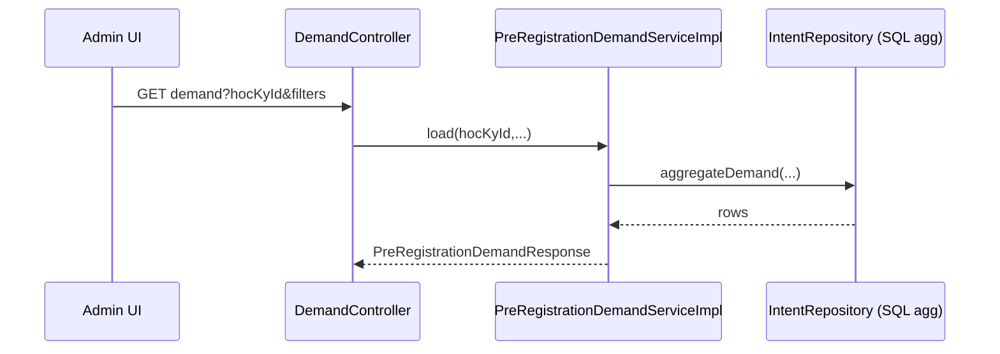

# Dev-Spec — F04 Admin PRE demand aggregation

| Mã | F04 |
|----|-----|
| BA | [`ba_flow.md`](ba_flow.md) |
| **Tiến độ triển khai** | **[`progress_report.md`](progress_report.md)** — rà soát 2026-05-09 |
| Controller | [`AdminPreRegistrationDemandController`](../../../../backend-core/src/main/java/com/example/demo/controller/AdminPreRegistrationDemandController.java) |
| Service | [`PreRegistrationDemandServiceImpl`](../../../../backend-core/src/main/java/com/example/demo/service/impl/PreRegistrationDemandServiceImpl.java) |
| Base path | **`GET /api/v1/admin/pre-registrations/demand`** |
| Sinh shell lớp từ demand | **`POST /api/v1/admin/pre-registrations/plan-sections`** — mô tả API trong **[F17 `dev_spec.md`](../F17_registration_capacity_planning_pipeline/dev_spec.md)** (mục 8) |

---

## 1) API contract

```
GET /api/v1/admin/pre-registrations/demand
Authorization: Bearer <JWT ADMIN>
```

| Query param | Kiểu | Required | Note |
|-------------|------|----------|------|
| `hocKyId` | Long | **yes** | Thiếu → `IllegalArgumentException` mapping 400 |
| `namNhapHoc` | Integer | no | cohort |
| `idNganh` | Long | no | ngành |
| `targetClassSize` | Integer | no | ≤0 hoặc null → default config |

Auth: **`@PreAuthorize("hasRole('ADMIN')")`** (xác nhận trên controller thực tế trong repo).

**Response 200**: [`PreRegistrationDemandResponse`](../../../../backend-core/src/main/java/com/example/demo/payload/response/PreRegistrationDemandResponse.java).

---

## 2) Response schema (field-by-field)

| Field | Kiểu | Ý nghĩa |
|-------|------|---------|
| `idHocKy` | Long | HK filter |
| `tenHocKy` | String | Label hiển thị (“HKx — yyyy-yyyy”) từ service |
| `namNhapHoc` | Integer \| null | Echo filter cohort nếu có |
| `idNganh` | Long \| null | Echo filter ngành |
| `tenNganh` | String \| null | Echo tên ngành |
| `targetClassSize` | int | Sau khi resolve default |
| `totalIntents` | long | Tổng intent across items (không nhầm với DISTINCT SV) |
| `totalRecommendedClasses` | int | \(\sum recommendedClasses\) |
| `items` | list | Xuống học phần |

[`PreRegistrationDemandItemResponse`](../../../../backend-core/src/main/java/com/example/demo/payload/response/PreRegistrationDemandItemResponse.java):

| Field | Ý |
|-------|---|
| `idHocPhan`, `maHocPhan`, `tenHocPhan`, `soTinChi` | Định danh HP |
| `namNhapHoc`, `idNganh`, `tenNganh` | Context slice (repeat per row để UX sort) |
| `totalIntent` | Count intent rows aggregate |
| `recommendedClasses` | `\max(1, ceil(totalIntent / targetClassSize))` — đúng nhánh trong service |

---

## 3) Logic service (thứ tự)

1. **Validate**: `hocKyId` không null → else throw IllegalArgument...
2. **Load HK**: không tìm thấy → `EntityNotFoundException` → 404 typical.
3. **Resolve target**: `@Value("${eduport.prereg.target-class-size-default:40}")` khi query param null/`<=0`.
4. **`intentRepository.aggregateDemand(hocKyId, namNhapHoc, idNganh)`** — trả projection Object[] hoặc DTO nhỏ tùy impl.
5. Map rows → items; **`recommendedClasses = Math.max(1, Math.ceil(totalIntent / classSize))`** (integer cast sau).
6. `totalIntents` = sum của `totalIntent`; `totalRecommendedClasses` = sum `recommendedClasses`.
7. Build response; nếu `idNganh` filter được set → load `tenNganh` từ [`NganhDaoTaoRepository`](../../../../backend-core/src/main/java/com/example/demo/repository/NganhDaoTaoRepository.java).

---

## 4) Lỗi HTTP

| Mã | Nguồn |
|----|-------|
| 400 | Missing `hocKyId` hoặc arg illegal |
| 403 | Không ADMIN |
| 404 | HK id unknown |
| 200 + empty items | Repo aggregate trả không dòng |

---

## 5) Sequence



---

## 6) Performance

- Aggregation phải dùng **GROUP BY học phần** trong SQL — không hydrate full entities intent trong RAM.
- Gợi ý index: `(id_hoc_ky)`, `(id_hoc_ky, id_nganh_dao_tao_sv?)` tuỳ schema intent — chỉnh theo migration thực.

---

## 7) Ví dụ gọi

```powershell
$u = "$base/api/v1/admin/pre-registrations/demand?hocKyId=1&targetClassSize=35"
Invoke-RestMethod -Headers $adminHdr -Uri $u
```

---

## 8) Test

[`PreRegistrationDemandServiceImplTest`](../../../../backend-core/src/test/java/com/example/demo/service/impl/PreRegistrationDemandServiceImplTest.java).

---

## 9) Lịch sử

| Ngày | Ghi |
|------|-----|
| 2026-05 | Draft |
| 2026-05 | Response field table, sequence, performance |
| 2026-05-09 | Link [`progress_report.md`](progress_report.md); implementation BE/FE/unit test khớp spec (xem báo cáo) |
