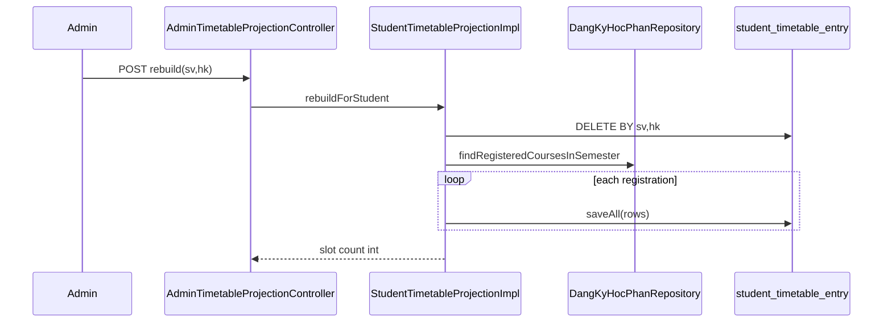

# Dev-Spec — F06 Admin timetable projection rebuild

| Mã | F06 |
|----|-----|
| BA | [`ba_flow.md`](ba_flow.md) |
| Endpoint | **`POST /api/v1/admin/timetable-projection/rebuild`** |
| Controller | [`AdminTimetableProjectionController`](../../../../backend-core/src/main/java/com/example/demo/controller/AdminTimetableProjectionController.java) |
| Service | [`IStudentTimetableProjection`](../../../../backend-core/src/main/java/com/example/demo/service/IStudentTimetableProjection.java) / [`StudentTimetableProjectionImpl`](../../../../backend-core/src/main/java/com/example/demo/service/impl/StudentTimetableProjectionImpl.java) |

---

## 1) API contract

```
POST /api/v1/admin/timetable-projection/rebuild
Authorization: Bearer <JWT ADMIN>
```

| Param | Kiểu | Bắt buộc |
|-------|------|----------|
| `sinhVienId` | Long | ✓ |
| `hocKyId` | Long | ✓ |

**Response** `200` `application/json` — `Map`:

```json
{
  "sinhVienId": 101,
  "hocKyId": 1,
  "rebuiltSlots": 37
}
```

| Field | Ý |
|-------|---|
| `rebuiltSlots` | Giá trị return của `rebuildForStudent` — **tổng** số rows đã insert qua các đăng ký của SV trong HK đó |

**Auth**: `@PreAuthorize("hasRole('ADMIN')")`.

**Lỗi**: Thiếu query param → Spring **400**. 403 non-admin.

---

## 2) Thuật toán `rebuildForStudent`

Nguồn: [`StudentTimetableProjectionImpl.rebuildForStudent`](../../../../backend-core/src/main/java/com/example/demo/service/impl/StudentTimetableProjectionImpl.java):

1. `entryRepository.deleteBySinhVienAndHocKy(sinhVienId, hocKyId)` — sweep toàn projection cặp đó.
2. `dangKyHocPhanRepository.findRegisteredCoursesInSemester(sinhVienId, hocKyId)` — lấy danh sách đăng ký “đang học”.
3. Với mỗi `DangKyHocPhan` gọi **`upsertForRegistrationInternal`** (không delete-by-id trong loop vì sweep đầu đã xoá projection toàn HK).
4. Cộng dồn số slot insert; log INFO `🔁 rebuild`.

Điểm khác **`upsertForRegistration(Long id)`** dùng cho event:

- `upsert`: `deleteByIdDangKy` **một** đăng ký → insert lại chỉ đăng ký đó.
- `rebuild`: wipe **theo HK** rồi rebuild all.

---

## 3) JSON TKB parsing

Giống F12/F06 inner loop: iterate `lop_hoc_phan.thoi_khoa_bieu_json` list map keys `thu`, `tiet`, `phong`, `ngay_bat_dau`, `ngay_ket_thuc`.

Nếu null/empty JSON → **`0` slots** contributed by that registration; rebuild vẫn tiếp tục các đăng ký khác.

---

## 4) Transaction boundary

| Method | Propagation |
|--------|--------------|
| `rebuildForStudent` | `@Transactional(REQUIRES_NEW)` — gọi được từ controller sync |
| Listener `projection.upsert` | `REQUIRES_NEW` để không kéo rollback transaction đăng ký |

Controller **không** bọc thêm `@Transactional` bắt buộc — một POST = một rebuild.

---

## 5) Idempotency

- UNIQUE DB `(id_dang_ky, slot_index)` ngăn trùng nếu code gọi song song hai lần — vẫn nên serialize theo UX admin button.
- Gọi rebuild hai lần liên tiếp cho cùng cặp → kết quả cuối giống nhau (steady state).

---

## 6) Observability

- Log lines prefix `[TKB-Projection]` và emoji trong impl — grep khi RCA.
- Metric ngoài scope — có thể thêm Counter `timetable_rebuild_total` nếu cần SRE.

---

## 7) Sequence diagram



---

## 8) Liên quan student read

[`TimetableController.getMySnapshot`](../../../../backend-core/src/main/java/com/example/demo/controller/TimetableController.java) đọc `projection.readForStudent` — không cache HTTP — refresh browser đủ thấy rebuild.

---

## 9) Test

[`StudentTimetableProjectionImplTest`](../../../../backend-core/src/test/java/com/example/demo/service/impl/StudentTimetableProjectionImplTest.java) — bổ sung case rebuild nếu chưa có (backlog QA).

Manual: sau POST, SQL `COUNT(*) WHERE id_sinh_vien=:sv AND id_hoc_ky=:hk`.

---

## 10) Lịch sử

- 2026-05 Draft ngắn.
- 2026-05 Mô tả thuật toán wipe+reinsert, contrast với listener upsert.
