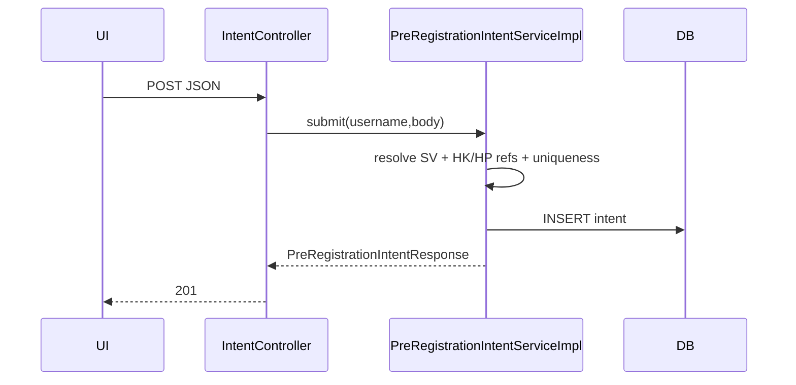

# Dev-Spec — F08 PreRegistrationIntent REST

| Mã | F08 |
|----|-----|
| BA | [`ba_flow.md`](ba_flow.md) |

---

## 1) API surface

Controller: [`PreRegistrationIntentController`](../../../../backend-core/src/main/java/com/example/demo/controller/PreRegistrationIntentController.java).

Base:**`/api/v1/pre-registrations/intents`**.

| Method | Path | Auth |
|--------|------|------|
| GET | `/me` | STUDENT `@PreAuthorize(hasRole STUDENT)` |
| POST | `/` | STUDENT |
| PUT | `/{intentId}` | STUDENT |
| DELETE | `/{intentId}` | STUDENT |

### 1.1 `GET /me`

Query **`hocKyId`** optional (`Long`): trả list [`PreRegistrationIntentResponse`](../../../../backend-core/src/main/java/com/example/demo/payload/response/PreRegistrationIntentResponse.java).

### 1.2 `POST /`

**201 Created** [`PreRegistrationIntentSubmitRequest`](../../../../backend-core/src/main/java/com/example/demo/payload/request/PreRegistrationIntentSubmitRequest.java):

| Field | Constraint |
|-------|------------|
| `idHocKy` | `@NotNull` |
| `idHocPhan` | `@NotNull` |
| `priority` | optional — `@Min(1)` |
| `ghiChu` | optional — length max 500 (annotation xem Java) |

### 1.3 `PUT /{intentId}`

**200 OK** payload giống POST — service verify owner + lifecycle.

### 1.4 `DELETE /{intentId}`

**204 No Content**.

---

## 2) Response DTO snapshot

[`PreRegistrationIntentResponse`](../../../../backend-core/src/main/java/com/example/demo/payload/response/PreRegistrationIntentResponse.java) chứa:

`id`, `idSinhVien`, HK join fields, HP join (`ma`,`ten`,`soTinChi`), `priority`, `ghiChu`, `createdAt`, `updatedAt`.

---

## 3) Service layer

Implement: [`PreRegistrationIntentServiceImpl`](../../../../backend-core/src/main/java/com/example/demo/service/impl/PreRegistrationIntentServiceImpl.java).

Điểm chính:

1. **`ensurePrePhaseOpen` / checker** đảm bảo chỉ trong PRE cohort window.
2. submit: uniqueness triple → `ResponseStatusException` **409** với tiếng Việt deterministic string.
3. update/delete load entity by PK + compare `intent.getSinhVien().getIdSinhVien()` vs resolver user.

Repositories: [`PreRegistrationIntentRepository`](../../../../backend-core/src/main/java/com/example/demo/repository/PreRegistrationIntentRepository.java).

---

## 4) Relation to other modules

| Module | Relation |
|---------|----------|
| F07 | Fallback PRE window on **`hoc_ky`** |
| F02 | Granular **`registration_window`** rows may override HK fallback |
| F04 | `aggregateDemand(...)` consumes same table |

---

## 5) Errors quick table

| Status | Scenario |
|--------|----------|
| 400 | Malformed JSON |
| 401 | Missing bearer |
| 403 | Not student / PRE closed |
| 404 | Wrong intent pk |
| 409 | Duplicate triple |
| 422 | Jakarta validation violations (`MethodArgumentNotValidException`) |

Chi tiết map global handler: **`cross/04_api_catalog`** §422 sample.

---

## 6) Sequence — submit

---

## 7) Test matrix (manual QA)

| # | Case |
|---|------|
| 1 | Duplicate POST same HP → 409 |
| 2 | DELETE người khác → 403 |
| 3 | CRUD after admin closes PRE window → forbidden |

Automated backlog: `@DataJpaTest` + `@WithMockUser`.

---

## 8) Frontend integration

SPA phải gửi Bearer; highlight conflict message từ 409 và suggest EDIT flow.

---

## 9) Lịch sử

| Ngày | |
|------|--|
| 2026-05 | Draft ngắn |
| 2026-05 | Full route table + test matrix |
