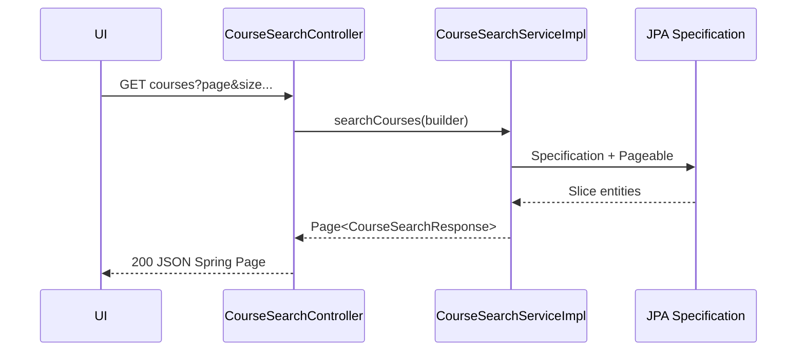

# Dev-Spec — F09 Course discovery APIs

| Mã | F09 |
|----|-----|
| BA | [`ba_flow.md`](ba_flow.md) |
| Cross | [`cross/04_api_catalog.md`](../../cross/04_api_catalog.md) §23 curl mẫu |

---

## 1) Public catalog (không JWT)

Theo cấu hình bảo mật dự án (`WebSecurityConfig`), các route dưới `/api/lop-hoc-phan/**` thường **permitAll** — xác nhận khi đổi security.

| Method | Path | Controller |
|--------|------|------------|
| GET | `/api/lop-hoc-phan/hoc-ky/{idHocKy}` | [`LopHocPhanController`](../../../../backend-core/src/main/java/com/example/demo/controller/LopHocPhanController.java) |
| GET | `/api/lop-hoc-phan/{id}` | idem |

**Mục đích**: list/detail nhanh không cần Bearer — hữu ích marketing / guest.

---

## 2) Rich search — `GET /api/v1/courses`

Controller: [`CourseSearchController`](../../../../backend-core/src/main/java/com/example/demo/controller/CourseSearchController.java).

### 2.1 RBAC

```java
@PreAuthorize("hasAnyRole('STUDENT', 'ADMIN', 'LECTURER')")
```

Vai trò JWT thực tế trong seed: `ROLE_STUDENT`, `ROLE_ADMIN`, `ROLE_LECTURER` — **không** dùng chuỗi `TEACHER`.

### 2.2 Query → `CourseSearchRequest`

| Param | Default | Ghi chú |
|-------|---------|---------|
| `keyword` | null | Tên/mã môn/mã lớp |
| `idHocKy` | null | HK scope |
| `idKhoa` | null | Filter khoa |
| `soTinChi` | null | |
| `loaiMon` | null | enum string |
| `idGiangVien` | null | F13 |
| `chiConCho` | false | map capacity |
| `trangThai` | `DANG_MO` | operational status lớp |
| `page` | 0 | 0-based |
| `size` | 20 | max 100 trong controller annotation |
| `sortBy` | `tenHocPhan` | whitelist trong specification |
| `sortDir` | `ASC` | |

### 2.3 Response

`ResponseEntity<Page<CourseSearchResponse>>` — chuẩn Spring (`content`, `totalElements`, …). Field chi tiết xem [`CourseSearchResponse`](../../../../backend-core/src/main/java/com/example/demo/payload/response/CourseSearchResponse.java).

### 2.4 Detail

`GET /api/v1/courses/{idLopHp}` — cùng PreAuthorize như search.

---

## 3) Service stack

[`ICourseSearchService`](../../../../backend-core/src/main/java/com/example/demo/service/ICourseSearchService.java) + implementation build `Specification` từ request — không đặt SQL raw trong controller.

---

## 4) Gợi ý chương trình đào tạo (optional same epic)

[`RegistrationSuggestionController`](../../../../backend-core/src/main/java/com/example/demo/controller/RegistrationSuggestionController.java) (`GET /api/v1/registration/suggestions/me`) — STUDENT, gợi ý theo khóa/CTĐT; dùng bổ trợ UX “đề xuất môn”.

---

## 5) Errors

| HTTP | Case |
|------|------|
| 401 | Thiếu JWT trên `/api/v1/courses` |
| 403 | JWT không có STUDENT/ADMIN/LECTURER |
| 404 | Không có `idLopHp` (detail/search service tùy) |

---

## 6) Frontend checklist

1. **Luôn** gửi `Authorization` cho `/api/v1/courses`.
2. Phân biệt rõ UX: nút “Xem catalogue công khai” vs “Tìm nâng cao trong portal”.
3. Paginate đúng `page` chứ không dùng offset lạ.

---

## 7) Ví dụ

```powershell
Invoke-RestMethod -Headers $hdr `
  "http://localhost:8080/api/v1/courses?idHocKy=1&chiConCho=true&page=0&size=20"
```

Chi tiết thêm trong [`cross/04_api_catalog.md`](../../cross/04_api_catalog.md) §21–§23.

---

## 8) `CourseSearchResponse` — các field báo luận văn nên nhắc

| Nhóm | Ví dụ field (Jackson) | BA dùng cho |
|------|----------------------|--------------|
| Học phần | `maHocPhan`, `tenHocPhan`, `soTinChi`, `loaiMon` | Bảng mô tả khóa |
| Lớp | `maLopHp`, `idLopHp` | Drill-down chi tiết endpoint |
| Vận hành | `siSoToiDa`, `siSoThucTe`, `siSoConLai`, `phanTramDay`, getter `isConCho()` | Lọc `chiConCho`; progress bar UX |
| GV | `tenGiangVien`, `idGiangVien` filter | Role lecturer |
| TKB preview | các field summarize (nếu có) trong DTO chi tiết | Card trước ĐK |

*(Đối chiếu file [`CourseSearchResponse.java`](../../../../backend-core/src/main/java/com/example/demo/payload/response/CourseSearchResponse.java) khi thêm field mới.)*

---

## 9) Sequence — search có phân trang



---

## 10) Performance hints

| Gợi ý | Lý do |
|-------|--------|
| Ít `size > 50` không cần thiết | Giảm join load |
| `idHocKy` luôn gửi khi SV đang trong một HK cố định | Index selective |

Chiến lược index DB: các cột FK `hoc_ky`, publish status được cover migration — xem **C03**.

---

## 11) Lịch sử

- 2026-05 Draft có trích đoạn `TEACHER` outdated.
- 2026-05 Đồng bộ `LECTURER`, bảng params, checklist.
- 2026-05 Field table discovery + perf + seq diagram parity F04/F08.
