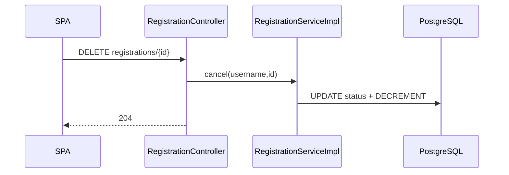

# Dev-Spec — F11 Registration cancel REST + Ingress/Kafka parity

| Mã | F11 |
|----|-----|
| BA | [`ba_flow.md`](ba_flow.md) |

---

## 1) REST API

```
DELETE /api/v1/registrations/{idDangKy}
Authorization: Bearer <JWT STUDENT>
```

Controller: [`RegistrationController.cancel`](../../../../backend-core/src/main/java/com/example/demo/controller/RegistrationController.java).

Service core: [`RegistrationServiceImpl.cancel`](../../../../backend-core/src/main/java/com/example/demo/service/impl/RegistrationServiceImpl.java).

### Algorithm (transactional body)

```text
resolveSinhVien(username)
fetch DangKyHocPhan by id
ownership check sv.id == d.sinhVien.id
status in (THANH_CONG | CHO_DUYET)
d.trangThaiDangKy = RUT_MON; save(d)
lopHocPhanRepository.decrementSiSoThucTe(lhp.id) if association exists
LOG CANCEL-HTTP
```

Return: **`Void`**, controller **`204 No Content`**.

Exceptions:

| Type | Mapping |
|------|---------|
| `EntityNotFoundException` không tìm thấy user/sv dk | Typical **500**/`404` theo `@ControllerAdvice` config — trong code throw not found trên dk → often 500 wrapper; QA confirm global handler |

Trong excerpt code: chỉ **`ResponseStatusException`** cho 403 / 409 rõ.

---

## 2) Ingress / Kafka

### 2.1 Go

`DELETE /api/v1/queue/huy-dang-ky` với `{ id_sinh_vien, id_lop_hp, id_hoc_ky }`.

### 2.2 Java processor

[`DangKyHocPhanServiceImpl.processCancellation`](../../../../backend-core/src/main/java/com/example/demo/service/impl/DangKyHocPhanServiceImpl.java):

1. Build idempotency key = `traceId` hoặc auto pattern.
2. Replay log có sẵn → early return (**idempotent**) — không ghi đè dữ liệu.
3. Tìm dkhp ACTIVE qua **`findRegisteredCoursesInSemester` + filter idLopHp**.
4. Nếu không tìm thấy: `writeLog(... REJECTED, DANG_KY_NOT_FOUND)`.
5. Update `RUT_MON`, decrement DB, **`writeLog SUCCESS CANCELLED`**, **`publishEvent(RegistrationCancelledEvent)`**.

Projection listener [`RegistrationTimetableProjectionListener.onCancelled`](../../../../backend-core/src/main/java/com/example/demo/event/RegistrationTimetableProjectionListener.java) → `projection.removeForRegistration(idDangKy)`.

---

## 3) Bất đối xứng sự kiện (engineering note — quan trọng cho luận văn)

| Path | `RegistrationCancelledEvent` |
|------|-------------------------------|
| REST `cancel` | **Không có** trong code hiện tại → **projection read-model không tự gỡ** qua listener cho hủy REST |
| Kafka `processCancellation` | **Có** |

**Workaround QA**: Gọi F06 **`POST rebuild`** snapshot sau demo — hoặc backlog: inject `ApplicationEventPublisher` vào `RegistrationServiceImpl` mirror payload Kafka builder.

Đồng phương diện, **REST register** trong `RegistrationServiceImpl` hiện cũng **không publish** **`RegistrationConfirmedEvent`** (Kafka path có).

---

## 4) Errors matrix

| Scenario | REST | Ingress |
|-----------|------|---------|
| Not owner | 403 | không áp —
| Wrong state | 409 | không áp —
| Missing row | EntityNotFound 404-ish | Kafka REJECT log |
| Replay cancel | không implement idempotent HTTP | ✅ idempotent keyed |

---

## 5) Sequence — REST only



*(Projection note: không event → manual rebuild / backlog.)*

---

## 6) Test ideas

| Test | Technique |
|------|-----------|
| Cancel success | Slice test `RegistrationServiceImpl` with mocks |
| Cancel wrong owner | expect `ResponseStatusException` Forbidden |
| Kafka cancel emits event | verify `ApplicationEventPublisher` mock `publish` invocation count 1 |

---

## 7) Lịch sử

| Ngày | |
|------|--|
| 2026-05 | Draft ngắn |
| 2026-05 | Document REST vs Kafka event asymmetry |
