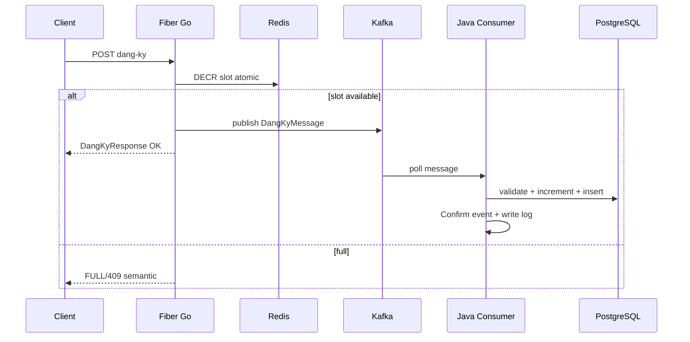

# Dev-Spec — F15 Go queue ingress + Kafka + Java consumer

| Mã | F15 |
|----|-----|
| BA | [`ba_flow.md`](ba_flow.md) |

---

## 1) Go service — `backend-queue`

### 1.1 Routing

Implement chính: [`backend-queue/handler/queue_handler.go`](../../../../backend-queue/handler/queue_handler.go).

| Verb | Path | Body / params | Purpose |
|------|------|----------------|--------|
| POST | `/api/v1/queue/dang-ky` | `DangKyRequest` `{ id_sinh_vien, id_lop_hp, id_hoc_ky }` | Ingress đăng ký |
| DELETE | `/api/v1/queue/huy-dang-ky` | `HuyCancelRequest` ids cùng cấu trúc | Hủy + release slot semantics |
| GET | `/api/v1/queue/slot/:id_lop_hp` | path param | Debug slot Redis |
| POST | `/api/v1/queue/pre-reg` | Payload pre-reg (Ingress từ core) | Sprint pre-reg không trùng với dkhp Kafka chính — xem repo |

Admin tooling: [`admin_handler.go`](../../../../backend-queue/handler/admin_handler.go)

| Verb | Path | Body |
|------|------|------|
| POST | `/api/v1/admin/khoi-tao-slot` | `{ id_lop_hp, si_so_toi_da }` seed Redis khớp sĩ số DB |

Domain structs: **`backend-queue/domain/model.go`** — `DangKyMessage`, `DangKyRequest`, ...

### 1.2 HTTP status mapping

Theo Fiber handler trong repo ingress:

| Status ingress / enum | HTTP gợi ý |
|----------------------|-----------|
| `OK` | **200** / **201*** (chuẩn hóa trong code — đọc file thực) |
| `FULL`, `DUPLICATE`, `REJECTED` | Một trong **409** family (prototype gom conflict) |
| `ERROR`/infra | **503** hoặc 500 |

*Đối chiếu code thực khi báo luận văn chính xác.*

### 1.3 Config ENV

[`config.Load`](../../../../backend-queue/config/config.go): `SERVER_PORT` (vd **3000**), Redis/Kafka URLs, topics `KAFKA_TOPIC`, ...

---

## 2) Payload parity Java ↔ Go

Kafka JSON camelCase/snake_case phải **deserialize** thành [`RegistrationMessageDto`](../../../../backend-core/src/main/java/com/example/demo/payload/request/RegistrationMessageDto.java).

**Trace / idempotency**: field `traceId` trên Go message — trong Java được dùng cho key idempotent (xem resolver trong `DangKyHocPhanServiceImpl`).

---

## 3) Java consumer pipeline

Chi tiết: [`DangKyHocPhanServiceImpl.processRegistration`](../../../../backend-core/src/main/java/com/example/demo/service/impl/DangKyHocPhanServiceImpl.java).

| Stage | Responsibility |
|-------|----------------|
| Deserialize | Kafka consumer bean → dto |
| Idempotency | [`RegistrationIdempotencyService`](../../../../backend-core/src/main/java/com/example/demo/service/impl/RegistrationIdempotencyService.java) + `registration_request_log` |
| Window gate | **`isOfficialRegistrationOpenFor`** — không cho PRE kafka |
| F16 Validate | Full chain Duplicate → Schedule → Prerequisite |
| Increment DB | **`lopHocPhanRepository.incrementSiSoThucTe`** — guarded update |
| Persist | Insert `DangKyHocPhan` SUCCESS state |
| Event | **`RegistrationConfirmedEvent`** → projection + logger |
| Log | **`writeLog`** outcome `SUCCESS` / failure codes |

Cancellation: **`processCancellation`** — idempotent, `DECREMENT` DB, **`RegistrationCancelledEvent`**, outcome `CANCELLED`/`REJECTED`.

---

## 4) Risks documented (engineering honesty)

| Risk | Explanation |
|------|-------------|
| **Double decrement** scenario | Ingress Redis first; Java may fail validations → stale negative perception — mitigation future: transactional outbox or refund Redis in consumer failure callback |
| **No JWT on Ingress** | Spoof identities — mitigation: API gateway/service mesh |

---

## 5) Deployment topology (dev vs prod sketch)

Dev:
```
localhost:3000 queue
localhost:8080 core consumer
Docker redis + kafka
```

Prod blueprint (thesis narrative):
```
Internet -> API GW (auth) -> internal queue LB -> Fiber pods
Kafka MSK -> Java consumer replicas (consumer group eduport-registration)
PostgreSQL RDS
Redis Elasticache
```

---

## 6) Sequence diagram



---

## 7) Security backlog

Xem **[`cross/06_rbac_security.md`](../../cross/06_rbac_security.md) § Go queue**.

---

## 8) Smoke test script

1. Seed slot admin Go.
2. `curl` một request hợp lệ và xem Kafka lag → `0`.
3. SELECT `registration_request_log` newest row SUCCESS.
4. Duplicate same `trace_id` replay → không duplicate dkhp row.

---

## 9) Lịch sử

| Ngày | |
|------|--|
| 2026-05 | Draft |
| 2026-05 | Bổ sung risks, parity, smoke |
