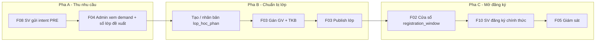

# BA-Flow — F17 Kế hoạch năng lực đăng ký: từ PRE đến lớp/GV/TKB

| Trường | Giá trị |
|--------|---------|
| Mã chức năng | F17 |
| Tên chức năng | Pipeline kế hoạch năng lực (capacity planning) sau đăng ký dự kiến |
| Vai trò chủ đạo | ADMIN (chủ), STUDENT (gián tiếp), LECTURER (gián tiếp) |
| Loại | Cross-process (tài liệu luồng tích hợp nhiều F) |
| Liên kết Dev-Spec | [`dev_spec.md`](dev_spec.md) |
| Trạng thái | Draft |

---

## 1) Mục đích

F17 **không** thay thế F04/F03/F02/… mà **gom một kế hoạch vận hành cụ thể** để Đào tạo:

1. Thu **nhu cầu thật** từ PRE (intent).
2. **Suy ra số section** cần mở (theo sĩ số mục tiêu, ví dụ 60 SV/lớp).
3. **Tạo và chuẩn bị** `lop_hoc_phan`, **gán giảng viên**, **nhập lịch** (TKB composite).
4. **Công bố** lớp và **mở cửa** đăng ký chính thức đúng cohort/ngành.
5. Cho phép SV **đăng ký** vào section đã publish.

Mục tiêu đọc giả: **GVHD / hội đồng / BA** hiểu **thứ tự việc** và **dữ liệu nào ở đâu**; dev dùng làm **master checklist** triển khai UI/API bổ sung sau này (xem §10 backlog).

---

## 2) Phạm vi và giới hạn

| Trong phạm vi F17 (mô tả) | Ngoài phạm vi (chức năng khác) |
|---------------------------|--------------------------------|
| Thứ tự nghiệp vụ, checkpoint, input/output giữa các F | Tự động sinh hàng loạt `lop_hoc_phan` từ một dòng F04 (chưa có API chuẩn — backlog §10) |
| Chỉ số `recommendedClasses`, `targetClassSize` | Dự báo CTĐT `ForecastMoLop` (nguồn khác PRE — chỉ **đối chiếu** khi họp) |
| Liên kết trạng thái publish `SHELL → SCHEDULED → PUBLISHED` (F03) | Giải bài toán xếp phòng toàn trường (solver) — tham chiếu module scheduling hiện có |

---

## 3) Sơ đồ luồng tích hợp (tóm tắt)



---

## 4) Bảng kế hoạch theo thứ tự thời gian (cụ thể)

Cột **Bước** là thứ tự đề xuất trong một học kỳ; có thể chồng lấn nhẹ (ví dụ mở cửa OFFICIAL chỉ sau khi publish), nhưng **không** đảo: SV không đăng ký chính thức vào lớp chưa publish.

| Bước | Khi nào làm | Ai | Việc cụ thể | Công cụ / F | Dữ liệu vào | Dữ liệu ra / kiểm tra |
|------|--------------|-----|-------------|-------------|-------------|------------------------|
| 1 | Trước / trong PRE | Admin | Cấu hình **cửa sổ PRE** theo `hoc_ky` + cohort + ngành | F02 | `hocKyId`, `phase=PRE`, `open_at`/`close_at`, scope | SV gửi được intent trong khung giờ |
| 2 | Trong PRE | SV | Gửi / sửa intent học phần | F08 | JWT SV, `hoc_ky`, chọn `hoc_phan` | Dòng `pre_registration_intent` |
| 3 | Sau khi đủ intent (hoặc cuối hạn PRE) | Đào tạo | Họp: chốt **sĩ số mục tiêu** (vd 40, 50, 60) theo quy chế | F04 | `GET .../pre-registrations/demand?hocKyId=&namNhapHoc=&idNganh=&targetClassSize=` | `items[].totalIntent`, `items[].recommendedClasses`, `totalRecommendedClasses` |
| 4 | Ngay sau bước 3 | Đào tạo | Quyết định **số lớp thực tế** ≥ hoặc điều chỉnh so với `recommendedClasses` (phòng, GV, chất lượng) | Quy trình nội bộ + (tuỳ) Forecast CTĐT | Biên bản họp | Danh sách “mở N section cho mã HP X” |
| 5 | Sau bước 4 | Admin hệ thống | **Tạo** các `lop_hoc_phan` (section): nút *Tạo shell* trên `/admin/pre-registration-demand` (gọi `plan-sections`) hoặc CRUD/seed | UI + `POST .../plan-sections` hoặc CRUD | Học kỳ, học phần, cohort/ngành trên dòng, quy mô lớp | Các `id_lop_hp` `SHELL` |
| 6 | Trước publish | Admin | **Gán giảng viên**; nhập **TKB composite** (slot) đủ điều kiện promote | F03 § gán GV, F07 legacy nếu dùng | `id_lop_hp`, `idGiangVien`, JSON lịch | `status_publish` tiến tới `SCHEDULED` khi đủ điều kiện (theo F03) |
| 7 | Trước mở OFFICIAL | Admin | **Publish** từng lớp hoặc bulk (đủ GV + lịch) | F03 publish | `id_lop_hp` | `status_publish = PUBLISHED` |
| 8 | Song song bước 5–7 hoặc sau | Admin | Cấu hình **cửa sổ OFFICIAL** (có thể khác cohort/ngành với PRE) | F02 | `phase=OFFICIAL`, scope | Checker từ chối đăng ký khi ngoài cửa |
| 9 | OFFICIAL mở | SV | Tra cứu lớp catalog + đăng ký | F09, F10 | JWT, `id_lop_hp` | `dang_ky_hoc_phan`, cập nhật chỗ |
| 10 | Trong kỳ | Admin | Theo dõi tỷ lệ lấp đầy, throughput | F05 | `hocKyId` | Dashboard |

---

## 5) Công thức nhu cầu (nhắc lại — khớp F04)

Trên mỗi dòng aggregate (học phần × cohort × ngành):

\[
\text{recommendedClasses} = \max\left(1,\ \left\lceil \frac{\text{totalIntent}}{\text{targetClassSize}} \right\rceil\right)
\]

- Ví dụ: `totalIntent = 180`, `targetClassSize = 60` ⇒ `recommendedClasses = 3`.
- Nếu Đào tạo chỉ đủ phòng cho 2 lớp ⇒ **nghiệp vụ** phải: tăng sĩ số, thêm ca, hoặc mở thêm HK sau — **không** tự quyết định bởi F04.

---

## 6) Checklist họp sau PRE (copy-paste)

- [ ] Đã xuất demand **đủ** filter cohort/ngành cần lên kế hoạch (ít nhất 1 lần `namNhapHoc` null để thấy tổng, và các lần tách cohort).
- [ ] Đã ghi rõ **`targetClassSize`** dùng trong họp (số trên UI/API khớp biên bản).
- [ ] Đối chiếu nhanh với **Forecast CTĐT** (nếu dùng) để phát hiện môn “intent thấp nhưng CTĐT báo cao” hoặc ngược lại.
- [ ] Bảng quyết định: cột **Mã HP | intent | đề xuất lớp | quyết định lớp | Ghi chú phòng/GV**.
- [ ] Sau khi tạo section: [ ] mỗi section có **GV** [ ] có **slot TKB** [ ] **publish** trước ngày mở OFFICIAL.
- [ ] **F02 OFFICIAL** đã tạo bản ghi `registration_window` khớp cohort/ngành (hệ thống chỉ coi cửa mở khi có window — xem F02 dev-spec).

---

## 7) Luồng phụ / ngoại lệ

| Mã | Tình huống | Xử lý nghiệp vụ |
|----|------------|-----------------|
| EX-PRE-EMPTY | Không có intent | F04 trả 200 rỗng; lên kế hoạch theo CTĐT/minimum offering, không kéo theo `recommendedClasses` |
| EX-OVER-DEMAND | `recommendedClasses` lớn hơn khả năng phòng | Họp điều chỉnh sĩ số, thêm section online, hoặc tách kỳ |
| EX-GV-LATE | Thiếu GV khi đến hạn publish | Không publish (F03); không mở OFFICIAL cho môn đó hoặc dùng lớp dự phòng |
| EX-WINDOW-MISS | Chỉnh ngày trên `hoc_ky` nhưng không có `registration_window` | Cửa vẫn **đóng** — phải tạo window F02 |

---

## 8) GIVEN-WHEN-THEN (pipeline)

| ID | Rule |
|----|------|
| F17-R1 | **GIVEN** PRE đã đóng và intent đã import vào DB **WHEN** admin gọi F04 với `targetClassSize=60` **THEN** mỗi dòng `items` có `recommendedClasses` khớp công thức §5. |
| F17-R2 | **GIVEN** chưa có `lop_hoc_phan` publish cho học phần X **WHEN** SV mở catalog/đăng ký **THEN** không thấy / không đăng ký được section X (theo filter F09/F10). |
| F17-R3 | **GIVEN** lớp đã `PUBLISHED` nhưng OFFICIAL window đóng **WHEN** SV gọi đăng ký **THEN** hệ thống từ chối theo F02 checker. |
| F17-R4 | **GIVEN** đủ GV + TKB theo F03 **WHEN** admin publish **THEN** `status_publish` chuyển `PUBLISHED` và section xuất hiện trong luồng đăng ký (tuỳ filter search). |

---

## 9) Wireframe ASCII (màn “Pipeline một học kỳ” — gợi ý UI tương lai)

```
┌── Kế hoạch HK2 2024-2025 ──────────────────────────────────────────┐
│ [1] Cửa PRE (F02)   : ON  01/08 → 15/08                               │
│ [2] Intent (F08)    : 1.240 dòng intent                               │
│ [3] Demand (F04)    : targetClassSize [ 60 ]  →  tổng lớp đề xuất: 42  │
│ [4] Section thực tế: [ nhập tay / import ]  (chưa auto từ F04)        │
│ [5] GV + TKB (F03)  : 38/42 publish-ready                             │
│ [6] Cửa OFF (F02)   : OFF 20/08 → 05/09                               │
│ [7] ĐK chính (F10)  : link tới F05                                    │
└──────────────────────────────────────────────────────────────────────┘
```

---

## 10) Backlog sản phẩm (ngoài phạm vi bắt buộc luận văn)

| ID | Ý tưởng | Giá trị | Ghi chú kỹ thuật ngắn |
|----|---------|---------|----------------------|
| BL-01 | API tạo N shell `lop_hoc_phan` từ demand / `sectionCount` | Giảm lỗi nhập tay | **Đã có:** `POST /api/v1/admin/pre-registrations/plan-sections` — UI wizard tuỳ chọn sau |
| BL-02 | Liên kết `recommendedClasses` với trường “plannedSections” trên báo cáo | Theo dõi thực hiện | Có thể là bảng mới hoặc metadata JSON trên họp |
| BL-03 | Export PDF/Excel biên bản họp từ response F04 | Bảo vệ đồ án | Chỉ compose từ API hiện có |

Chi tiết kỹ thuật backlog: [`dev_spec.md`](dev_spec.md) §8.

---

## 11) Acceptance criteria (cho bộ tài liệu F17)

- [ ] BA có thể đọc §4 và chạy checklist §6 mà không cần mở code.
- [ ] Mỗi bước §4 map được sang ít nhất một **F** hoặc ghi rõ “quy trình nội bộ”.
- [ ] Công thức §5 khớp implementation F04 (`PreRegistrationDemandServiceImpl`).
- [ ] §7 và §8 bao phủ trường hợp “chưa window”, “chưa publish”.

---

## 12) Phụ thuộc chức năng

| F | Vai trò trong pipeline |
|---|-------------------------|
| F02 | Cửa PRE / OFFICIAL (`registration_window`) |
| F03 | Section, GV, TKB, publish |
| F04 | Thống kê intent + số lớp đề xuất |
| F05 | Giám sát sau mở đăng ký |
| F08 | Nguồn intent |
| F09 | SV xem lớp catalog |
| F10 | Đăng ký chính thức |
| F12 | TKB cá nhân sau cấp chỗ (projection — xem F10/F06) |

---

## 13) Lịch sử

| Ngày | Ghi chú |
|------|---------|
| 2026-05-10 | Khởi tạo F17 — kế hoạch pipeline cụ thể sau yêu cầu làm rõ luồng |
