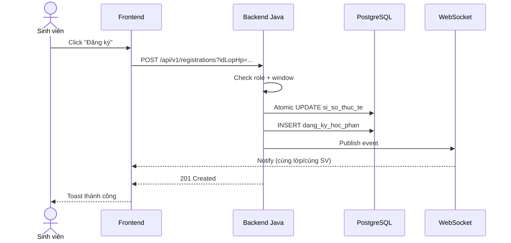

# Dev-Spec — `<Mã chức năng>` `<Tên chức năng>`

> Template tài liệu Dev-Spec. Khi viết tài liệu thật, **xóa hết block `> Hướng dẫn:`** và thay bằng nội dung thật.
>
> Tiêu chí của Dev-Spec: dev cấp thấp hoặc agent yếu phải implement được mà không cần hỏi lại nghiệp vụ.

| Trường | Giá trị |
|--------|---------|
| Mã chức năng | F0x |
| Tên chức năng | ... |
| Liên kết BA-Flow | `features/F0x_*/ba_flow.md` |
| Module backend | `backend-core` / `backend-queue` |
| Module frontend | `frontend/src/pages/...` |
| Trạng thái | Draft / Reviewed / Approved |

---

## 1) Tóm tắt kỹ thuật

> Hướng dẫn: 5-10 dòng nêu cách tiếp cận kỹ thuật.
> - Pattern dùng (chain of responsibility, event-driven, projection, ...).
> - Lý do chọn cách này.
> - Phụ thuộc kỹ thuật chính.

---

## 2) Phụ thuộc

### 2.1 Phụ thuộc bên trong dự án
- Service: ...
- Repository: ...
- Event: ...

### 2.2 Phụ thuộc bên ngoài
- Spring Kafka, Spring Data Redis, Spring Security, ...
- WebSocket: `spring-boot-starter-websocket` (Java), `@stomp/stompjs` (frontend).

---

## 3) Domain model

### 3.1 Entity / Class
| Tên | File | Mô tả ngắn |
|-----|------|------------|
| ... | `backend-core/src/main/java/com/example/demo/domain/entity/...` | ... |

### 3.2 Enum
| Tên | Giá trị | Ý nghĩa |
|-----|---------|---------|
| ... | A, B, C | ... |

### 3.3 Value Object / DTO
| Tên | Field | Kiểu | Ràng buộc |
|-----|-------|------|-----------|
| ... | ... | ... | ... |

---

## 4) DB schema

### 4.1 Bảng chính

#### Bảng `<ten_bang>`
| Cột | Kiểu | NULL | Default | Ràng buộc | Mô tả |
|-----|------|------|---------|-----------|-------|
| id_x | BIGINT | NO | auto | PK | ... |
| ... | ... | ... | ... | ... | ... |

Index:
- `idx_x_y` trên `(cot_x, cot_y)`.
- `uq_x_z` UNIQUE trên `(cot_x, cot_z)`.

Ràng buộc bảng:
- FK: `id_y` → `bang_y(id_y)` ON DELETE RESTRICT.
- CHECK: `cot_x > 0`.

### 4.2 Migration SQL

```sql
-- migration_<feature>.sql
CREATE TABLE IF NOT EXISTS ... (
    ...
);
CREATE INDEX IF NOT EXISTS ... ON ...;
```

### 4.3 Seed dữ liệu test

```sql
INSERT INTO ... (...) VALUES (...);
```

---

## 5) API contract

### 5.1 Bảng tổng

| Method | URL | Auth | Mô tả ngắn |
|--------|-----|------|------------|
| GET | `/api/...` | STUDENT | ... |
| POST | `/api/...` | STUDENT | ... |

### 5.2 Endpoint chi tiết

#### `<METHOD> <URL>`

Mục đích: ...

Auth:
- Header: `Authorization: Bearer <jwt>`.
- Role: `ROLE_STUDENT`.

Path param:
| Tên | Kiểu | Mô tả |
|-----|------|-------|
| ... | ... | ... |

Query param:
| Tên | Kiểu | Bắt buộc | Mặc định | Mô tả |
|-----|------|----------|----------|-------|
| ... | ... | ... | ... | ... |

Request body:
```json
{
  "field1": "...",
  "field2": 0
}
```

Schema body:
| Field | Kiểu | Bắt buộc | Ràng buộc | Mô tả |
|-------|------|----------|-----------|-------|
| field1 | string | yes | length 1..100 | ... |
| field2 | integer | yes | >= 0 | ... |

Response 200/201:
```json
{
  "id": 123,
  "status": "OK"
}
```

Schema response:
| Field | Kiểu | Mô tả |
|-------|------|-------|
| id | long | ID bản ghi tạo |
| status | string | OK / FAILED |

Error code:
| HTTP | App code | Khi nào | Message gợi ý |
|------|----------|---------|---------------|
| 400 | VALIDATION_ERROR | ... | "Dữ liệu không hợp lệ: ..." |
| 401 | UNAUTHENTICATED | thiếu/sai JWT | "Chưa đăng nhập." |
| 403 | FORBIDDEN | sai role | "Bạn không có quyền thực hiện thao tác này." |
| 404 | NOT_FOUND | id không tồn tại | "Không tìm thấy ..." |
| 409 | CONFLICT | trùng dữ liệu | "Đã tồn tại ..." |
| 422 | BUSINESS_RULE_FAIL | sai rule nghiệp vụ | "Không được phép vì ..." |
| 500 | INTERNAL_ERROR | exception khác | "Lỗi hệ thống, vui lòng thử lại." |

Ví dụ curl:
```bash
curl -X POST http://localhost:8080/api/... \
  -H "Authorization: Bearer $TOKEN" \
  -H "Content-Type: application/json" \
  -d '{"field1":"abc","field2":1}'
```

---

## 6) Validation rules per field

| Field | Rule | Mã lỗi | Message |
|-------|------|--------|---------|
| ... | not blank, length 1..50 | VAL_FIELD_EMPTY | ... |
| ... | regex `^[A-Z0-9]+$` | VAL_FIELD_FORMAT | ... |

Validation phía nào áp dụng:
- Frontend: chặn submit và hiển thị inline error.
- Backend: dùng `@Valid` + `ConstraintValidator` + service-level checks.

---

## 7) Business rules

> Hướng dẫn: copy từ BA-Flow nhưng thêm cột `Implementation`.

| Mã rule | Phát biểu | Implementation gợi ý |
|---------|-----------|----------------------|
| BR-01 | ... | Service `<X>` method `<y()>`. |
| BR-02 | ... | DB constraint UNIQUE. |

---

## 8) Sequence diagram

> Hướng dẫn: viết bằng mermaid. Ví dụ:



---

## 9) Edge case

| Mã | Tình huống | Hành vi mong đợi |
|----|-----------|------------------|
| EC-01 | Submit khi network chậm, timeout 30s | Backend kết thúc giao dịch atomic, frontend retry vẫn không double-charge nhờ idempotency. |
| EC-02 | Hai SV bấm cùng lúc khi còn 1 slot | Chỉ 1 SV thành công, SV còn lại nhận `409` "Lớp đã đầy". |
| EC-03 | Cửa sổ đóng giữa lúc gửi request | Backend từ chối với mã `WINDOW_CLOSED`. |

---

## 10) Event và message phát ra

### 10.1 Domain event
| Tên | Khi phát | Payload |
|-----|----------|---------|
| `RegistrationConfirmedEvent` | Sau khi commit | `{idDangKy, idLopHp, idSinhVien, ts}` |

### 10.2 Kafka topic
| Topic | Khi publish | Payload |
|-------|-------------|---------|
| `eduport.dang-ky-hoc-phan` | Khi có request từ Go queue | DTO ... |

### 10.3 WebSocket channel
| Channel | Direction | Payload | Subscriber |
|---------|-----------|---------|------------|
| `/topic/lop/{id_lop}` | server -> client | `{soSlotConLai, ts}` | tất cả SV xem lớp |
| `/user/queue/registration` | server -> user | `{type, idDangKy, status}` | SV vừa thao tác |

---

## 11) Test case

### 11.1 Unit test
| Mã | Mục tiêu | Class test |
|----|---------|------------|
| UT-01 | Validate happy path | `<X>ServiceTest#shouldRegisterWhenWindowOpen` |
| UT-02 | Reject khi cửa sổ đóng | `<X>ServiceTest#shouldRejectWhenWindowClosed` |

### 11.2 Integration test
| Mã | Kịch bản | Tool |
|----|---------|------|
| IT-01 | API end-to-end với Testcontainers Postgres | Spring Boot Test |
| IT-02 | Concurrent 200 SV/1 slot | k6 hoặc Gatling |

### 11.3 Manual test
| Mã | Bước | Kết quả mong đợi |
|----|------|------------------|
| MT-01 | Đăng nhập SV → vào màn ... | ... |

---

## 12) Hướng dẫn implement step-by-step

> Hướng dẫn: viết theo thứ tự thực thi để dev cấp thấp/agent yếu cũng làm được.

1. Tạo migration SQL: ...
2. Cập nhật entity: ...
3. Tạo DTO request/response: ...
4. Tạo repository: ...
5. Tạo service interface và impl: ...
6. Cập nhật controller: ...
7. Cập nhật `WebSecurityConfig` nếu cần.
8. Viết unit test.
9. Viết tích hợp test.
10. Cập nhật frontend: ...

---

## 13) Quan sát & log

- Log INFO: vào điểm bắt đầu xử lý kèm `traceId`.
- Log WARN: khi reject business rule, đính kèm mã rule.
- Log ERROR: exception kèm payload an toàn (không log token).
- Metric: counter `registration.success`, `registration.fail`, histogram `registration.latency`.

---

## 14) Lịch sử sửa đổi

| Ngày | Người | Thay đổi |
|------|-------|----------|
| ... | ... | Tạo mới |
