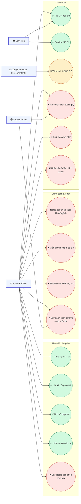

# Sơ đồ Use Case toàn hệ thống EduPort (Mermaid)

> Mermaid không có kiểu UML use case chính thức nên dùng `flowchart LR` với:
> - Actor: hình `[Tên]` (chữ nhật)
> - Use case: hình `(("Tên"))` (oval)
> - Cụm nghiệp vụ: `subgraph`
>
> **Chú thích trạng thái** (gắn vào nhãn use case):
> - `✅` đã có cả backend + UI
> - `🟡` mới có backend hoặc mới có UI
> - `❌` chưa có (đề xuất bổ sung)

---

## 1. Sơ đồ tổng quan (Overview – tất cả role)

```mermaid
flowchart LR
  classDef done fill:#d1fadf,stroke:#067647,color:#054f31
  classDef partial fill:#fef0c7,stroke:#b54708,color:#7a2e0e
  classDef todo fill:#fee4e2,stroke:#b42318,color:#7a271a
  classDef actor fill:#eef4ff,stroke:#3538cd,color:#2d31a6,stroke-width:2px

  SV["🎓 Sinh viên"]:::actor
  GV["👨‍🏫 Giảng viên"]:::actor
  CV["🧭 Cố vấn HT"]:::actor
  AD["👨‍💼 Admin Đào Tạo"]:::actor
  KT["💼 Admin Kế Toán"]:::actor
  PT["🛠️ Phòng Đào Tạo"]:::actor
  SYS["⏱️ System / Cron"]:::actor
  PG["🏦 Cổng thanh toán"]:::actor

  subgraph M1[" M1 · Cổng SV "]
    UC_DASH(("✅ Dashboard SV"))
    UC_HSCN(("✅ Tra cứu hồ sơ"))
    UC_REQ_HOSO(("❌ Yêu cầu đổi hồ sơ kèm minh chứng"))
    UC_NOTIF(("❌ Inbox / thông báo"))
  end

  subgraph M2[" M2 · Học vụ & CTĐT "]
    UC_DEGREE(("✅ Cây CTĐT (Degree Audit)"))
    UC_TRANS(("✅ Bảng điểm / Transcript"))
    UC_GRAD_REQ(("❌ Đăng ký xét tốt nghiệp"))
    UC_WARN(("❌ Cảnh báo học vụ"))
  end

  subgraph M3[" M3 · Đăng ký HP "]
    UC_PRECART(("✅ Giỏ pre-registration"))
    UC_INTENT(("✅ Pre-reg intent"))
    UC_FILTER(("✅ Lọc môn"))
    UC_FILTER_FREE(("❌ Lọc theo khung giờ rảnh"))
    UC_SUGGEST(("🟡 Gợi ý học lại"))
    UC_VALID(("✅ Validation Rules Engine"))
    UC_REGISTER(("✅ Đăng ký chính thức (Giờ Vàng)"))
    UC_DROP(("✅ Rút môn"))
    UC_PRE_PDF(("❌ Xuất TKB nháp PDF/ảnh"))
  end

  subgraph M4[" M4 · Tài chính "]
    UC_WALLET(("✅ Ví sinh viên"))
    UC_QR(("✅ Thanh toán QR"))
    UC_INVOICE(("❌ Hóa đơn điện tử PDF"))
    UC_FIN_SUM(("✅ Giám sát tài chính"))
    UC_RECON(("❌ Đối soát giao dịch"))
    UC_BLACKLIST(("❌ Blacklist nợ HP / chặn thi"))
    UC_WEBHOOK(("🟡 Webhook PG (mới MOCK)"))
  end

  subgraph M5[" M5 · TKB & Khảo thí "]
    UC_TKB(("✅ TKB SV"))
    UC_TKB_GV(("❌ TKB GV"))
    UC_TKB_ICAL(("❌ Export iCal .ics"))
    UC_EXAM_SV(("✅ Lịch thi & phiếu dự thi"))
    UC_EXAM_ADMIN(("❌ Tạo & phân phòng thi"))
    UC_EXAM_GV(("❌ Phân công gác thi"))
    UC_EXAM_PDF(("❌ In bìa giấy thi PDF"))
    UC_RATE_GV(("✅ Đánh giá GV"))
    UC_RATE_VIEW_GV(("❌ GV xem feedback của mình"))
    UC_RATE_GATING(("❌ Bắt rate trước khi xem điểm"))
  end

  subgraph M6[" M6 · Quản trị & Đào tạo "]
    UC_USER(("❌ CRUD Tài khoản & Role"))
    UC_PWD(("❌ Reset / Password Policy"))
    UC_KHOA(("🟡 CRUD Khoa/Ngành"))
    UC_HP(("🟡 CRUD Học phần + tiên quyết"))
    UC_HK(("🟡 CRUD Học kỳ"))
    UC_LOP(("🟡 CRUD Lớp HC"))
    UC_GV_MGMT(("🟡 CRUD Giảng viên"))
    UC_SV_IMPORT(("❌ Import SV Excel"))
    UC_GV_IMPORT(("❌ Import GV Excel"))
    UC_CTDT(("🟡 Gắn HP vào CTĐT (visual node)"))
    UC_PHONG(("🟡 CRUD Phòng học"))
    UC_SLOT(("🟡 CRUD Slot/Tiết"))
    UC_GV_BUSY(("🟡 GV Busy Slot"))
    UC_TKB_BLOCK(("🟡 Khóa khung TKB"))
    UC_SOLVER(("🟡 Solver xếp lịch tự động"))
    UC_FORECAST(("🟡 Dự báo mở lớp"))
    UC_PUBLISH(("✅ Mở lớp / xuất bản LopHocPhan"))
    UC_REGWIN(("✅ Cấu hình giờ vàng"))
    UC_MONITOR(("✅ Giám sát giờ vàng"))
    UC_KILL(("❌ Kill-switch / Pause Queue"))
    UC_BANNER(("❌ Pop-up bảo trì broadcast"))
    UC_CHANGE_SET(("🟡 ChangeSet đổi TKB sau publish"))
    UC_BULLETIN(("❌ Tạo bulletin / push thông báo"))
    UC_SCHOLAR(("❌ Học bổng / Khen thưởng / Kỷ luật"))
    UC_REWARD(("❌ Điểm rèn luyện"))
    UC_REQUEST_FORM(("❌ Đơn rút trễ / bảo lưu / chuyển ngành"))
  end

  subgraph M7[" M7 · Cổng Giảng viên "]
    UC_ATT_GV(("✅ Điểm danh lớp"))
    UC_ATT_QR(("❌ QR điểm danh động (10s/refresh)"))
    UC_GRADE(("✅ Nhập điểm"))
    UC_GRADE_WEIGHT(("❌ Cột điểm tùy biến (weighted)"))
    UC_GRADE_IO(("❌ Import/Export Excel điểm"))
    UC_GRADE_SIGN(("❌ Ký số/OTP chốt điểm immutable"))
    UC_APPEAL_GV(("✅ Xử lý phúc khảo"))
    UC_ADVISORY(("✅ Cố vấn at-risk list"))
    UC_ADVISORY_DEEP(("❌ Deep search advisee"))
    UC_ADVISORY_NOTE(("❌ Note nhật ký advisee"))
    UC_APPROVE_REQ(("❌ Duyệt đơn rút/bảo lưu"))
    UC_CLASS_BOARD(("❌ Class Board / push lớp"))
    UC_SYLLABUS(("❌ Quản lý đề cương / tài liệu"))
  end

  subgraph M8[" M8 · Bảo mật & Audit "]
    UC_LOGIN(("✅ Đăng nhập JWT"))
    UC_MFA(("✅ MFA admin (email OTP)"))
    UC_RBAC(("✅ RBAC"))
    UC_AUDIT(("🟡 Audit trail (mới Grading/Retake)"))
    UC_AUDIT_ALL(("❌ Audit đầy đủ (login/đăng ký/payment)"))
    UC_FORGOT(("❌ Forgot password"))
    UC_SSO(("❌ SSO Email trường (OAuth2)"))
    UC_DEVICE(("❌ Device Manager / Revoke session"))
    UC_AUTOLOGOUT(("❌ Auto-logout idle 15p"))
    UC_PWD_FIRST(("❌ Bắt đổi pass lần đầu"))
  end

  %% Sinh viên
  SV --> UC_DASH & UC_HSCN & UC_REQ_HOSO & UC_NOTIF
  SV --> UC_DEGREE & UC_TRANS & UC_GRAD_REQ & UC_WARN
  SV --> UC_PRECART & UC_INTENT & UC_FILTER & UC_FILTER_FREE & UC_SUGGEST & UC_REGISTER & UC_DROP & UC_PRE_PDF
  SV --> UC_WALLET & UC_QR & UC_INVOICE
  SV --> UC_TKB & UC_TKB_ICAL & UC_EXAM_SV & UC_RATE_GV
  SV --> UC_REQUEST_FORM & UC_REWARD
  SV --> UC_LOGIN & UC_FORGOT & UC_DEVICE & UC_AUTOLOGOUT & UC_PWD_FIRST

  %% Giảng viên
  GV --> UC_TKB_GV
  GV --> UC_ATT_GV & UC_ATT_QR
  GV --> UC_GRADE & UC_GRADE_WEIGHT & UC_GRADE_IO & UC_GRADE_SIGN
  GV --> UC_APPEAL_GV
  GV --> UC_EXAM_GV & UC_EXAM_PDF
  GV --> UC_CLASS_BOARD & UC_SYLLABUS
  GV --> UC_RATE_VIEW_GV
  GV --> UC_LOGIN & UC_MFA

  %% Cố vấn (kế thừa GV)
  CV --> UC_ADVISORY & UC_ADVISORY_DEEP & UC_ADVISORY_NOTE & UC_APPROVE_REQ

  %% Admin Đào Tạo
  AD --> UC_USER & UC_PWD
  AD --> UC_KHOA & UC_HP & UC_HK & UC_LOP & UC_GV_MGMT & UC_SV_IMPORT & UC_GV_IMPORT & UC_CTDT
  AD --> UC_PHONG & UC_SLOT & UC_GV_BUSY & UC_TKB_BLOCK & UC_SOLVER & UC_FORECAST & UC_PUBLISH
  AD --> UC_REGWIN & UC_MONITOR & UC_KILL & UC_BANNER & UC_CHANGE_SET
  AD --> UC_EXAM_ADMIN
  AD --> UC_BULLETIN & UC_SCHOLAR & UC_REWARD & UC_REQUEST_FORM
  AD --> UC_RBAC & UC_AUDIT & UC_AUDIT_ALL

  %% Admin Kế toán
  KT --> UC_FIN_SUM & UC_RECON & UC_BLACKLIST & UC_INVOICE
  KT --> UC_WEBHOOK
  PT --> UC_REQ_HOSO

  %% System
  SYS --> UC_VALID
  SYS --> UC_REGISTER
  SYS --> UC_AUDIT_ALL
  SYS --> UC_BANNER

  %% Payment Gateway
  PG --> UC_WEBHOOK
  PG --> UC_QR

  class UC_DASH,UC_HSCN,UC_DEGREE,UC_TRANS,UC_PRECART,UC_INTENT,UC_FILTER,UC_VALID,UC_REGISTER,UC_DROP,UC_WALLET,UC_QR,UC_FIN_SUM,UC_TKB,UC_EXAM_SV,UC_RATE_GV,UC_PUBLISH,UC_REGWIN,UC_MONITOR,UC_ATT_GV,UC_GRADE,UC_APPEAL_GV,UC_ADVISORY,UC_LOGIN,UC_MFA,UC_RBAC done
  class UC_SUGGEST,UC_WEBHOOK,UC_KHOA,UC_HP,UC_HK,UC_LOP,UC_GV_MGMT,UC_CTDT,UC_PHONG,UC_SLOT,UC_GV_BUSY,UC_TKB_BLOCK,UC_SOLVER,UC_FORECAST,UC_CHANGE_SET,UC_AUDIT partial
  class UC_REQ_HOSO,UC_NOTIF,UC_GRAD_REQ,UC_WARN,UC_FILTER_FREE,UC_PRE_PDF,UC_INVOICE,UC_RECON,UC_BLACKLIST,UC_TKB_GV,UC_TKB_ICAL,UC_EXAM_ADMIN,UC_EXAM_GV,UC_EXAM_PDF,UC_RATE_VIEW_GV,UC_RATE_GATING,UC_USER,UC_PWD,UC_SV_IMPORT,UC_GV_IMPORT,UC_KILL,UC_BANNER,UC_BULLETIN,UC_SCHOLAR,UC_REWARD,UC_REQUEST_FORM,UC_AUDIT_ALL,UC_FORGOT,UC_SSO,UC_DEVICE,UC_AUTOLOGOUT,UC_PWD_FIRST,UC_ATT_QR,UC_GRADE_WEIGHT,UC_GRADE_IO,UC_GRADE_SIGN,UC_ADVISORY_DEEP,UC_ADVISORY_NOTE,UC_APPROVE_REQ,UC_CLASS_BOARD,UC_SYLLABUS todo
```

---

## 2. Use case chi tiết – Sinh viên

```mermaid
flowchart LR
  classDef done fill:#d1fadf,stroke:#067647
  classDef partial fill:#fef0c7,stroke:#b54708
  classDef todo fill:#fee4e2,stroke:#b42318
  classDef actor fill:#eef4ff,stroke:#3538cd,stroke-width:2px

  SV["🎓 Sinh viên"]:::actor
  PG["🏦 Cổng thanh toán"]:::actor
  SYS["⏱️ System"]:::actor

  subgraph AUTH[" Đăng nhập & bảo mật "]
    L1(("✅ Đăng nhập (MSSV + mật khẩu)"))
    L2(("❌ Đổi mật khẩu lần đầu"))
    L3(("❌ Quên mật khẩu (email reset)"))
    L4(("❌ SSO Email trường"))
    L5(("❌ Device Manager / Revoke phiên"))
    L6(("❌ Auto-logout idle 15p"))
  end

  subgraph PROFILE[" Hồ sơ & Học vụ "]
    P1(("✅ Xem dashboard"))
    P2(("✅ Xem hồ sơ cá nhân + CVHT"))
    P3(("❌ Cập nhật email/SĐT trực tiếp"))
    P4(("❌ Yêu cầu đổi CCCD/BHYT kèm ảnh"))
    P5(("✅ Xem cây CTĐT (Degree Audit)"))
    P6(("✅ Xem transcript / GPA"))
    P7(("❌ Đăng ký xét tốt nghiệp"))
    P8(("❌ Xem cảnh báo học vụ"))
    P9(("❌ Xem điểm rèn luyện"))
    P10(("❌ Inbox thông báo"))
  end

  subgraph REG[" Đăng ký học phần "]
    R1(("✅ Tìm kiếm môn học"))
    R2(("❌ Lọc theo khung giờ rảnh"))
    R3(("✅ Bỏ vào giỏ pre-reg"))
    R4(("✅ Gửi pre-reg intent"))
    R5(("🟡 Xem gợi ý học lại"))
    R6(("✅ Đăng ký chính thức (giờ vàng)"))
    R7(("✅ Rút môn"))
    R8(("❌ Xuất TKB nháp PDF/ảnh"))
  end

  subgraph FIN[" Tài chính "]
    F1(("✅ Xem ví + giao dịch"))
    F2(("✅ Tạo QR thanh toán"))
    F3(("✅ Xác nhận MOCK"))
    F4(("❌ Tải hóa đơn PDF"))
  end

  subgraph TKBEXAM[" TKB & Khảo thí "]
    T1(("✅ Xem TKB tuần"))
    T2(("❌ Export iCal .ics"))
    T3(("✅ Xem lịch thi + SBD"))
    T4(("✅ Đánh giá GV"))
    T5(("❌ Bắt đánh giá GV trước khi xem điểm"))
  end

  subgraph FORM[" Đơn từ "]
    D1(("✅ Đơn phúc khảo điểm"))
    D2(("❌ Đơn rút môn trễ hạn"))
    D3(("❌ Đơn bảo lưu HK"))
    D4(("❌ Đơn chuyển ngành"))
    D5(("❌ Đăng ký KTX/BHYT"))
  end

  subgraph ATT[" Điểm danh "]
    A1(("✅ Check-in điểm danh"))
    A2(("❌ Quét QR động"))
  end

  SV --> L1 & L2 & L3 & L4 & L5 & L6
  SV --> P1 & P2 & P3 & P4 & P5 & P6 & P7 & P8 & P9 & P10
  SV --> R1 & R2 & R3 & R4 & R5 & R6 & R7 & R8
  SV --> F1 & F2 & F3 & F4
  SV --> T1 & T2 & T3 & T4 & T5
  SV --> D1 & D2 & D3 & D4 & D5
  SV --> A1 & A2

  PG --> F2 & F3
  SYS --> P8 & R6 & T5

  class L1,P1,P2,P5,P6,R1,R3,R4,R6,R7,F1,F2,F3,T1,T3,T4,D1,A1 done
  class R5 partial
  class L2,L3,L4,L5,L6,P3,P4,P7,P8,P9,P10,R2,R8,F4,T2,T5,D2,D3,D4,D5,A2 todo
```

---

## 3. Use case chi tiết – Giảng viên (gồm Cố vấn HT)

```mermaid
flowchart LR
  classDef done fill:#d1fadf,stroke:#067647
  classDef partial fill:#fef0c7,stroke:#b54708
  classDef todo fill:#fee4e2,stroke:#b42318
  classDef actor fill:#eef4ff,stroke:#3538cd,stroke-width:2px

  GV["👨‍🏫 Giảng viên"]:::actor
  CV["🧭 Cố vấn HT"]:::actor

  subgraph TKB[" TKB cá nhân "]
    G1(("❌ Xem TKB giảng dạy tuần/tháng"))
    G2(("❌ Cảnh báo trùng giờ giảng"))
  end

  subgraph CLASS[" Lớp giảng dạy "]
    C1(("✅ Xem danh sách lớp phụ trách"))
    C2(("✅ Tạo buổi điểm danh"))
    C3(("✅ Sửa trạng thái có/vắng"))
    C4(("❌ Sinh QR động 10s/refresh"))
    C5(("❌ Class Board: thông báo lớp"))
    C6(("❌ Push email/notification cho lớp"))
    C7(("❌ Quản lý đề cương / tài liệu"))
  end

  subgraph GRADE[" Nhập điểm "]
    GR1(("✅ Nhập điểm nháp (CHO_CONG_BO)"))
    GR2(("✅ Công bố điểm (DA_CONG_BO)"))
    GR3(("❌ Cấu hình cột điểm có trọng số"))
    GR4(("❌ Import điểm từ Excel"))
    GR5(("❌ Export bảng điểm Excel"))
    GR6(("❌ Ký số/OTP chốt điểm immutable"))
  end

  subgraph EXAM[" Khảo thí "]
    E1(("❌ Xem lịch coi thi cá nhân"))
    E2(("❌ In bìa giấy thi PDF"))
    E3(("❌ Xác nhận hoàn thành ca gác"))
  end

  subgraph APPEAL[" Phúc khảo "]
    AP1(("✅ Nhận đơn phúc khảo"))
    AP2(("✅ Cập nhật điểm mới + lý do"))
  end

  subgraph FB[" Đánh giá "]
    FB1(("❌ Xem feedback SV đánh giá GV"))
    FB2(("❌ Phản hồi nội bộ"))
  end

  subgraph ADV[" Cố vấn học tập "]
    V1(("✅ Danh sách SV at-risk"))
    V2(("❌ Deep profile advisee (TC + ĐĐ + điểm)"))
    V3(("❌ Ghi note nhật ký gọi advisee"))
    V4(("❌ Duyệt đơn rút trễ / bảo lưu"))
    V5(("❌ Báo cáo CVHT cuối kỳ"))
  end

  GV --> G1 & G2
  GV --> C1 & C2 & C3 & C4 & C5 & C6 & C7
  GV --> GR1 & GR2 & GR3 & GR4 & GR5 & GR6
  GV --> E1 & E2 & E3
  GV --> AP1 & AP2
  GV --> FB1 & FB2

  CV --> V1 & V2 & V3 & V4 & V5

  class C1,C2,C3,GR1,GR2,AP1,AP2,V1 done
  class G1,G2,C4,C5,C6,C7,GR3,GR4,GR5,GR6,E1,E2,E3,FB1,FB2,V2,V3,V4,V5 todo
```

---

## 4. Use case chi tiết – Admin (Đào tạo)

```mermaid
flowchart LR
  classDef done fill:#d1fadf,stroke:#067647
  classDef partial fill:#fef0c7,stroke:#b54708
  classDef todo fill:#fee4e2,stroke:#b42318
  classDef actor fill:#eef4ff,stroke:#3538cd,stroke-width:2px

  AD["👨‍💼 Admin Đào Tạo"]:::actor
  PT["🛠️ Phòng Đào Tạo"]:::actor
  SYS["⏱️ System"]:::actor

  subgraph USER[" Quản trị tài khoản "]
    U1(("❌ CRUD User"))
    U2(("❌ Gán/đổi role"))
    U3(("❌ Khóa/mở account"))
    U4(("❌ Reset mật khẩu"))
    U5(("❌ Bắt đổi pass lần đầu"))
    U6(("❌ Password policy + đổi định kỳ"))
    U7(("✅ Cấu hình MFA"))
    U8(("✅ Phân quyền RBAC"))
  end

  subgraph MASTER[" Master Data "]
    MD1(("🟡 CRUD Khoa"))
    MD2(("🟡 CRUD Ngành"))
    MD3(("🟡 CRUD Học kỳ"))
    MD4(("🟡 CRUD Học phần + tiên quyết"))
    MD5(("🟡 CRUD Lớp hành chính"))
    MD6(("🟡 CRUD Giảng viên"))
    MD7(("❌ Import SV Excel"))
    MD8(("❌ Import GV Excel"))
    MD9(("🟡 Gắn HP vào CTĐT"))
    MD10(("❌ Visual node CTĐT (drag-drop)"))
  end

  subgraph SCHED[" Xếp lịch & Mở lớp "]
    S1(("🟡 CRUD Phòng học"))
    S2(("🟡 CRUD Slot/Tiết"))
    S3(("🟡 GV Busy Slot"))
    S4(("🟡 Khóa khung TKB"))
    S5(("🟡 Forecast nhu cầu mở lớp"))
    S6(("🟡 Solver tự động (Backtracking)"))
    S7(("✅ Mở lớp / publish LopHocPhan"))
    S8(("🟡 ChangeSet sau publish"))
    S9(("❌ Phân công GV vào LHP"))
  end

  subgraph WINDOW[" Giờ Vàng "]
    W1(("✅ Cấu hình RegistrationWindow"))
    W2(("✅ Giám sát đăng ký realtime"))
    W3(("✅ Pre-reg demand stats"))
    W4(("✅ Timetable projection tools"))
    W5(("❌ Kill-switch toàn cục"))
    W6(("❌ Pause / resume queue"))
    W7(("❌ Pop-up bảo trì broadcast"))
  end

  subgraph EXAMA[" Khảo thí "]
    EA1(("❌ Tạo lịch thi hàng loạt"))
    EA2(("❌ Phân phòng thi"))
    EA3(("❌ Sinh phiếu dự thi + SBD"))
    EA4(("❌ Phân công GV gác thi"))
    EA5(("❌ In bìa thi / DSPT PDF"))
    EA6(("❌ Cấm thi do nợ HP"))
  end

  subgraph FORMA[" Đơn từ & Học vụ "]
    FA1(("❌ Duyệt yêu cầu đổi hồ sơ"))
    FA2(("❌ Workflow đơn rút trễ / bảo lưu"))
    FA3(("❌ Xét tốt nghiệp"))
    FA4(("❌ Cảnh báo học vụ tự động"))
    FA5(("❌ Học bổng / khen thưởng / kỷ luật"))
    FA6(("❌ Điểm rèn luyện"))
  end

  subgraph COMM[" Truyền thông "]
    CM1(("❌ Tạo bulletin"))
    CM2(("❌ Push thông báo theo Khoa/Ngành/Khóa"))
    CM3(("❌ Cấu hình SMTP/SMS"))
  end

  subgraph AUDIT[" Audit & Báo cáo "]
    AU1(("✅ Analytics dashboard"))
    AU2(("🟡 Audit trail (mới Grading/Retake)"))
    AU3(("❌ Audit đầy đủ (login/đăng ký/payment)"))
    AU4(("❌ Phổ điểm Histogram"))
    AU5(("❌ Báo cáo theo Khoa cho Trưởng khoa"))
  end

  AD --> U1 & U2 & U3 & U4 & U5 & U6 & U7 & U8
  AD --> MD1 & MD2 & MD3 & MD4 & MD5 & MD6 & MD7 & MD8 & MD9 & MD10
  AD --> S1 & S2 & S3 & S4 & S5 & S6 & S7 & S8 & S9
  AD --> W1 & W2 & W3 & W4 & W5 & W6 & W7
  AD --> EA1 & EA2 & EA3 & EA4 & EA5 & EA6
  AD --> CM1 & CM2 & CM3
  AD --> AU1 & AU2 & AU3 & AU4 & AU5
  AD --> FA3 & FA4 & FA5 & FA6

  PT --> FA1 & FA2

  SYS --> FA4 & W7 & AU3 & EA6

  class U7,U8,S7,W1,W2,W3,W4,AU1 done
  class MD1,MD2,MD3,MD4,MD5,MD6,MD9,S1,S2,S3,S4,S5,S6,S8,AU2 partial
  class U1,U2,U3,U4,U5,U6,MD7,MD8,MD10,S9,W5,W6,W7,EA1,EA2,EA3,EA4,EA5,EA6,FA1,FA2,FA3,FA4,FA5,FA6,CM1,CM2,CM3,AU3,AU4,AU5 todo
```

---

## 5. Use case chi tiết – Admin Kế toán & Cổng thanh toán

---

## 6. Tóm tắt số liệu

| Role | Tổng UC dự kiến | ✅ Done | 🟡 Partial | ❌ Todo |
|---|---|---|---|---|
| Sinh viên | ~38 | 19 | 1 | 18 |
| Giảng viên | ~24 | 7 | 0 | 17 |
| Cố vấn HT | ~5 | 1 | 0 | 4 |
| Admin Đào Tạo | ~52 | 8 | 14 | 30 |
| Admin Kế Toán | ~15 | 6 | 1 | 8 |

> Lưu ý: số đếm đã loại trừ các use case chỉ thuộc System/Cron và phần authentication chéo.

---

## 7. Cách render

- VS Code: cài extension **Markdown Preview Mermaid Support** rồi mở file.
- Web: copy từng block vào https://mermaid.live để chỉnh sửa.
- Word/PDF báo cáo: dùng `mmdc` (Mermaid CLI) export PNG/SVG hoặc dùng `wordtool/examples/render-mermaid-from-chuong2.js` đã có sẵn trong dự án.
